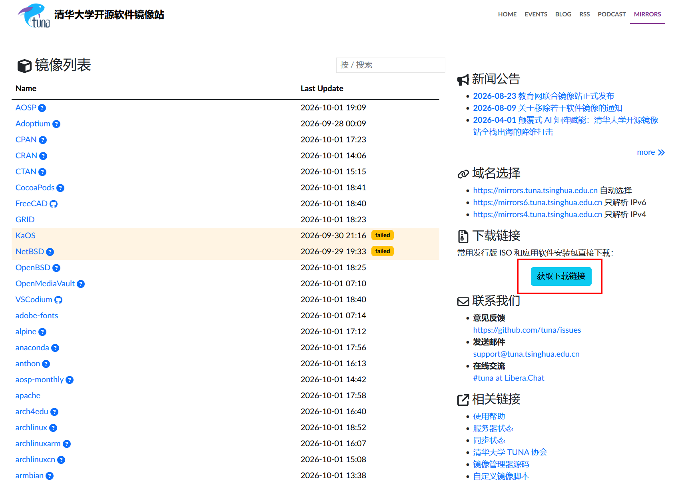
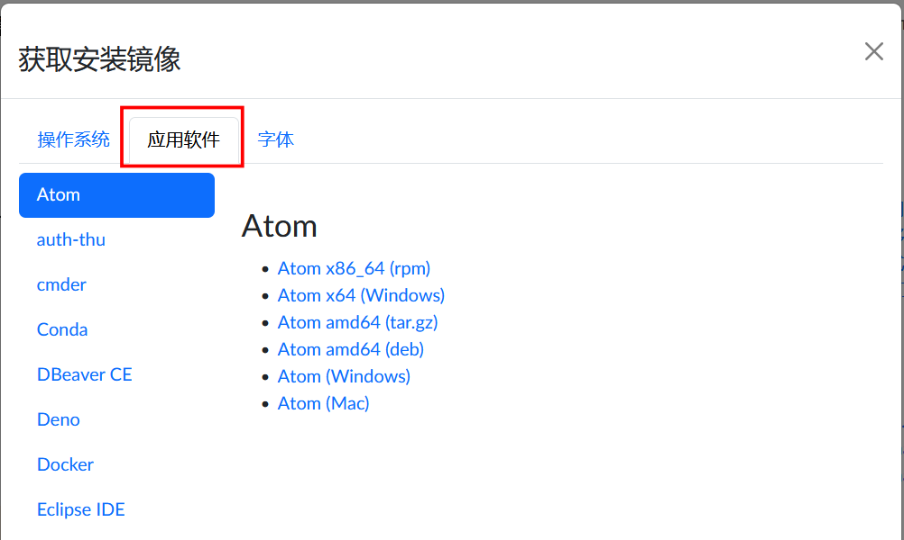
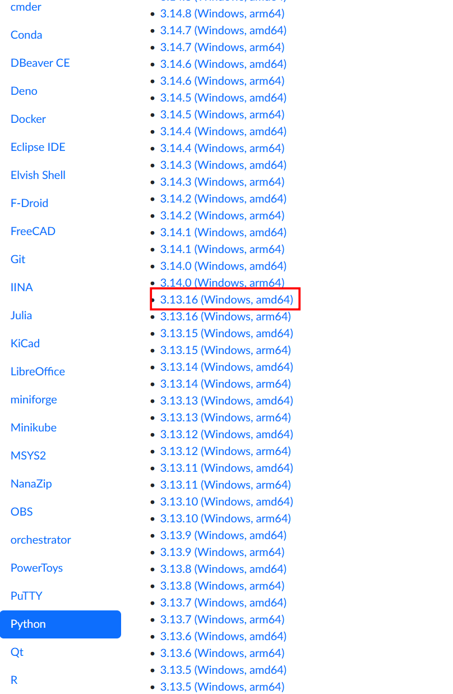
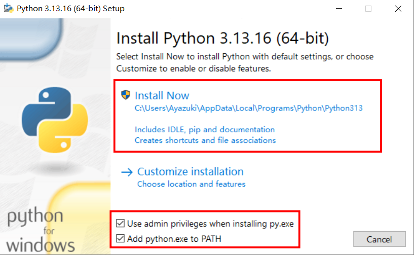
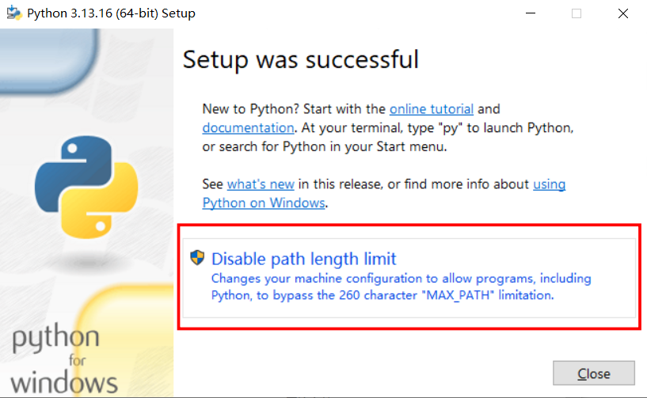
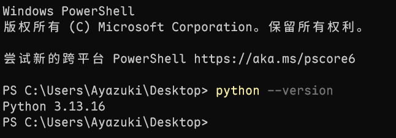
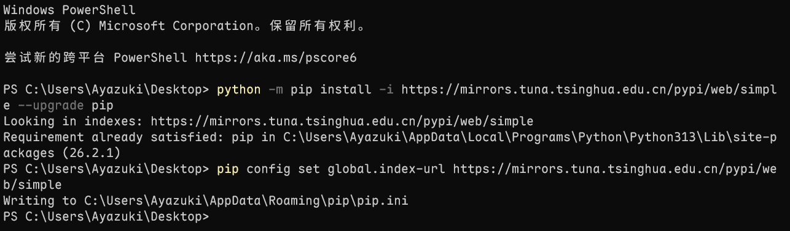

# 一、搭建Python开发环境

国内互联网环境直连Python官网下载python很慢，这里推荐使用[清华开源镜像网站](https://mirrors.tuna.tsinghua.edu.cn)进行Python的下载。建议收藏这个网站，因为这个网站后续还会一直用到。
在镜像站首页点击**获取下载链接**按钮，点击**应用软件**按钮，下拉页面找到**Python**，选择喜欢的版本号下载，如果这里推荐下载Python3.13.16。

**题外话** 关于amd64和arm64如何选择

|          | amd64 (x86-64)                | arm64 (aarch64)                                                 |
| -------- |:-----------------------------:| --------------------------------------------------------------- |
| 主导厂商 | Intel、AMD                    | Apple、高通、AWS、华为鲲鹏等                                    |
| 典型场景 | 传统 PC、笔记本、大多数服务器 | Mac(M 系列)、手机、树莓派、云服务器(AWS Graviton、阿里云倚天等) |

执行下载好的`python-3.13.16-amd64.exe`文件进行python的安装。

选择在安装python时赋予管理员权限以及将python加入环境变量。

选择解除路径长度限制，这是 Windows 系统的一个历史遗留限制：默认最大路径长度为 260 个字符。最后可以关闭安装引导了。

安装完成后打开windows终端输入 `python --version`,如果打印出版本号，则证明python已经安装完毕。

接下来给pip进行换源和更换为国内的清华源来提高下载速度。这里参考[清华官方pip换源教程](https://mirrors.tuna.tsinghua.edu.cn/help/pypi/)：

首先将pip更新到最新版本,在Windows终端上执行以下命令:`python -m pip install -i https://mirrors.tuna.tsinghua.edu.cn/pypi/web/simple --upgrade pip`

执行pip的更新结束后对pip换源，将清华源替换为默认的pip官方源，在Windows终端上执行以下命令:`pip config set global.index-url https://mirrors.tuna.tsinghua.edu.cn/pypi/web/simple`

