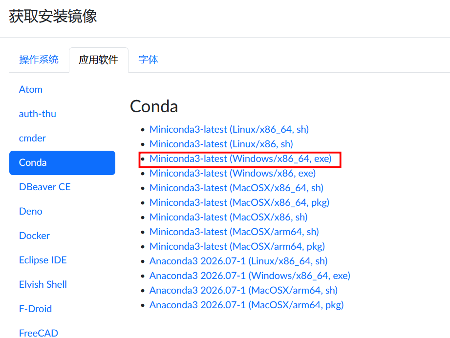
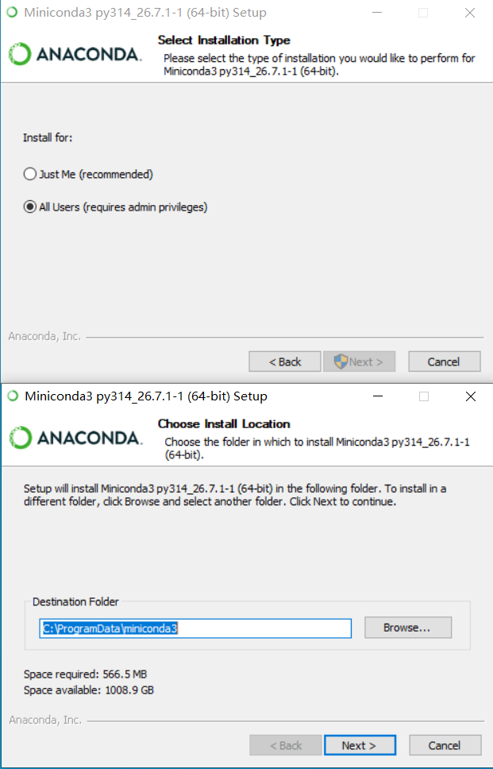
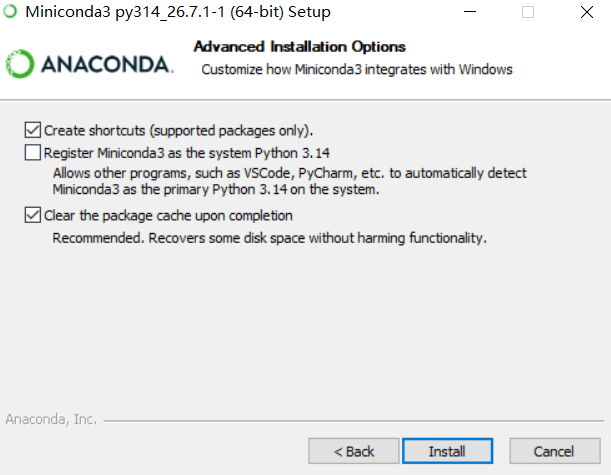
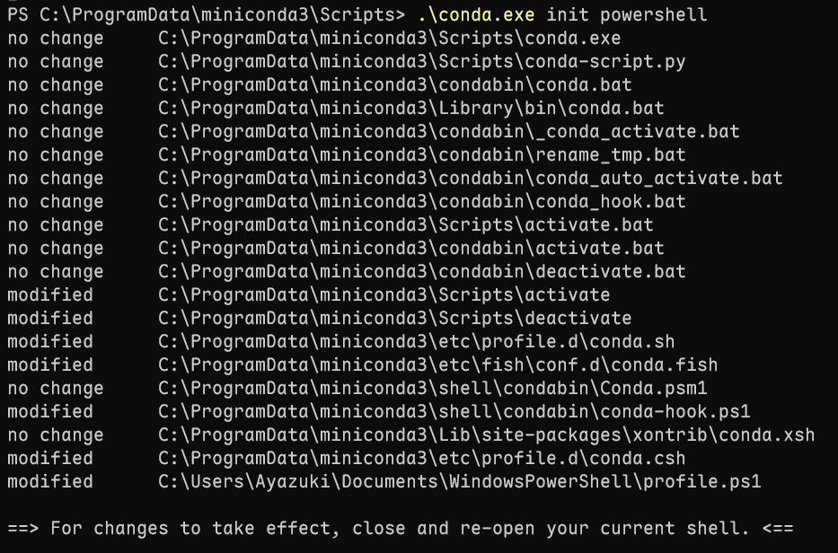
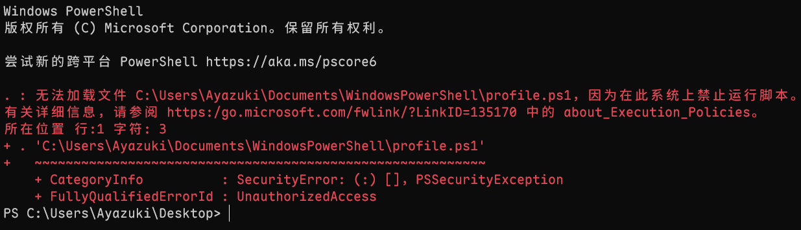
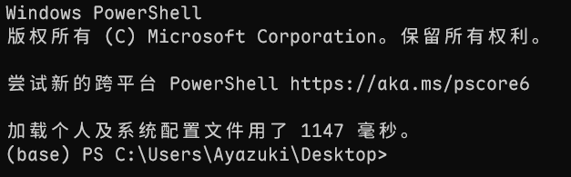

# 二、安装miniconda

### 为什么要安装conda？

conda 是一个**包管理器 + 环境管理器**，用conda可以给每个项目建一个独立环境，不污染系统级python，也方便复现论文的实验和共享自己配置的虚拟环境，Anaconda = Miniconda+图形化页面+大量预装科学计算包。经过我自己的摸索经验发现Anaconda的图形化页面和预装的包用的很少，还是Miniconda简单够用。

### 安装miniconda

首先来到[清华开源镜像网站](https://mirrors.tuna.tsinghua.edu.cn)进行miniconda的下载，在镜像站首页点击**获取下载链接**按钮，点击**应用软件**按钮，下拉页面找到**conda**，选择`Miniconda3-latest (Windows/x86_64, exe)`进行下载。



**题外话** 关于x86_64和x86如何选择 (优先选 **x86_64**，现代电脑基本都是 64 位)

|          | x86_64                                                                         | x86                                                              |
|:--------:|:------------------------------------------------------------------------------:|:----------------------------------------------------------------:|
| 位数     | 64                                                                             | 32                                                               |
| 典型场景 | 现代 PC、笔记本、服务器、Windows 10/11、Linux、Docker/WSL2、科学计算、深度学习 | 老旧 32 位 Windows、老工控机、嵌入式、legacy 软件/驱动、旧版系统 |

执行`Miniconda3-latest-Windows-x86_64.exe`安装包安装，安装过程中的`install for`选择自己喜欢的就行，安装路径也是选择自己喜欢的就行。



这里的安装页面会提供三个选项：

第一个选项是在 Windows 开始菜单里创建 Miniconda 的文件夹和快捷方式，可以勾选。

第二个选项是允许其他程序（如 VSCode、PyCharm 等）自动将 Miniconda3 检测为系统上的主 Python。会覆盖掉你之前安装的系统级python，建议不勾选。

第三个选项是安装完成后清理包缓存，可以勾选。



点击`Install`静候安装完成即可。

安装完成后在Windows终端输入`conda --version`会提示

```
PS C:\Users\Ayazuki\Desktop> conda --version
conda : 无法将“conda”项识别为 cmdlet、函数、脚本文件或可运行程序的名称。请检查名称的拼写，如果包括路径
，请确保路径正确，然后再试一次。
所在位置 行:1 字符: 1
+ conda --version
+ ~~~~~
    + CategoryInfo          : ObjectNotFound: (conda:String) [], CommandNotFoundException
    + FullyQualifiedErrorId : CommandNotFoundException
```

这是因为`Powershell`现在不认识这个命令，这就需要让它认识到这个命令。
进入到miniconda的安装目录的Scripts下在终端执行`.\conda.exe init powershell`然后重启终端。



重启终端发现红字报错，这是因为Windows PowerShell 默认的安全策略默认禁止运行任何脚本文件。



需要修改一下当前用户的 PowerShell 执行策略,在终端上执行`Set-ExecutionPolicy -Scope CurrentUser RemoteSigned`，执行完毕后重启终端。



如果不喜欢打开终端自动激活base环境可以在终端执行`conda config --set auto_activate false`来取消base环境的自动激活。取消base环境的自动激活不影响`Powershell`对conda命令的识别。
最后在终端上输入`conda --version`,打印出conda的版本号说明conda已经安装完毕了。

```
PS C:\Users\Ayazuki\Desktop> conda --version
conda 26.7.1
```

接下来对conda更换清华源来提高`conda install`的速度
参考[清华源官方更换conda源教程](https://mirrors.tuna.tsinghua.edu.cn/help/anaconda/)

编辑``C:\Users\<YourUserName>\.condarc``文件，使用记事本打开，将以下内容替换原有的
文件内容。

```
channels:
  - defaults
show_channel_urls: true
default_channels:
  - https://mirrors.tuna.tsinghua.edu.cn/anaconda/pkgs/main
  - https://mirrors.tuna.tsinghua.edu.cn/anaconda/pkgs/r
  - https://mirrors.tuna.tsinghua.edu.cn/anaconda/pkgs/msys2
custom_channels:
  conda-forge: https://mirrors.tuna.tsinghua.edu.cn/anaconda/cloud
  pytorch: https://mirrors.tuna.tsinghua.edu.cn/anaconda/cloud
```

如果你之前执行过`conda config --set auto_activate false`

那么换源后你的文本内容应该是这样的:

```
channels:
  - defaults
show_channel_urls: true
default_channels:
  - https://mirrors.tuna.tsinghua.edu.cn/anaconda/pkgs/main
  - https://mirrors.tuna.tsinghua.edu.cn/anaconda/pkgs/r
  - https://mirrors.tuna.tsinghua.edu.cn/anaconda/pkgs/msys2
custom_channels:
  conda-forge: https://mirrors.tuna.tsinghua.edu.cn/anaconda/cloud
  pytorch: https://mirrors.tuna.tsinghua.edu.cn/anaconda/cloud

auto_activate: false
```

修改完`.condarc`文件后在Windows终端上执行`conda clean -i`清理索引缓存，conda到此已经更换为了清华源。

### conda的基本命令示例

创建一个名为 `myenv` 的新环境:

`conda create --name myenv`

创建指定版本的环境：

`conda create --name myenv python=3.8`

以上命令创建一个名为 `myenv` 的新环境，并指定 Python 版本为 3.8。

激活环境：

`conda activate myenv`

以上命令激活名为 `myenv` 的环境。

要退出当前环境使用以下命令：

`conda deactivate`

查看所拥有的全部虚拟环境：

`conda env list`

以上命令查看所有已创建的环境。

删除环境：

`conda env remove --name myenv`

以上命令删除名为 `myenv` 的环境。

安装包：

`conda install package_name`

以上命令安装名为 `package_name` 的软件包。

安装指定版本的包：

`conda install package_name=1.2.3`

以上命令安装 `package_name` 的指定版本。

更新包：

`conda update package_name`

以上命令更新已安装的`package_name`软件包。

卸载包：

`conda remove package_name`

以上命令卸载已安装的`package_name`软件包。

查看已安装的包：

`conda list`

查看当前环境下已安装的所有软件包及其版本。

查看帮助：

`conda --help`

以上命令获取 `conda` 命令的帮助信息。

查看 `conda` 版本：

`conda --version`

以上命令查看安装的 `conda` 版本。

搜索包：

`conda search package_name`

以上命令在 `conda` 仓库中搜索指定的软件包。

清理不再需要的包：

`conda clean --all`

以上命令清理` conda` 缓存，删除不再需要的软件包。
