# 三、安装git

### 为什么要安装git？

Git是一个版本控制工具,简单来说就是记录项目代码修改历史的工具。很多AI工具直接依赖git环境才能工作，它们靠git来追踪文件的变化。如果你对AI修改的代码不满意，就可以通过git回滚代码。

### 安装git

首先来到[清华开源镜像网站](https://mirrors.tuna.tsinghua.edu.cn)进行git的下载，在镜像站首页点击**获取下载链接**按钮，点击**应用软件**按钮，下拉页面找到**Git**，选择`Git 2.56.0 (64-bit, exe)`进行下载。

执行下载好的`Git-2.55.0.5-64-bit.exe`,选择自己喜欢的安装路径，到`Select Components`页面

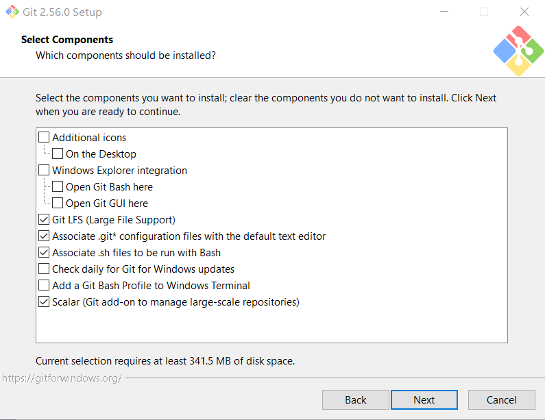

第一个选项是为git添加桌面快捷方式

第二个选项是为右键菜单增加`在此打开 Git Bash`和`在此打开Git GUI`的功能

第三个选项是为git增加大文件支持

第四个选项是用默认文本编辑器打开配置文件

第五个选项是shell 脚本默认用 Git Bash 执行

第六个选项是每天为git检查更新

第七个选项是在Windows终端里可以直接选 Git Bash启动

第八个选项是为git增加管理超大型仓库的功能

这八个选项按需勾选即可。

选择好后到添加git到开始菜单，按需选择，继续`Next`

接下来进入选择Git的默认编辑器页面，我这里选择默认使用`Vim`，继续`Next`

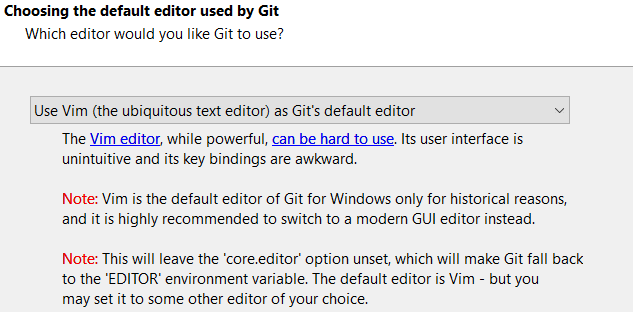

接下来进入决定git的主分支名称的界面，第一个是将主分支命名为master，第二个是将主分支命名为main，按照喜好选取即可。

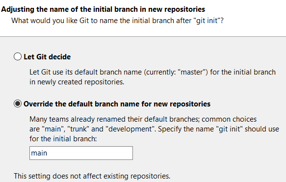

接下来进入调整你的 path 环境变量界面

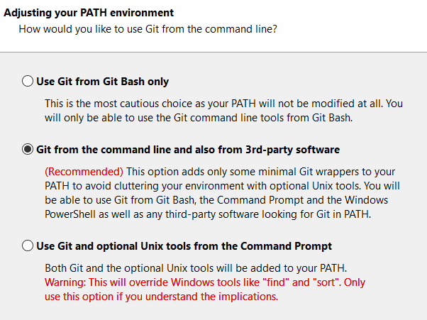

第一个选项是只允许在`Git Bash` 中使用 Git

第二个选项是从命令行以及第三方软件使用 Git，是Git官方推荐的选项

第三个是使用命令提示符中的 Git 和可选的 Unix 工具，这里官方给了警告，请确保你自己明确知道这个选项是在干什么再选这个选项

这里我选择第二个选项，Next。

接下来进入选择SSH工具的选项

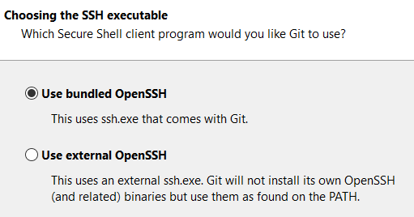

第一个选项是使用Git自带的SSH工具，第二个选项是使用外部，也就是你自己安装的SSH工具。这里我选择Git自带的SSH工具。

接下来进入选择HTTPS传输界面 

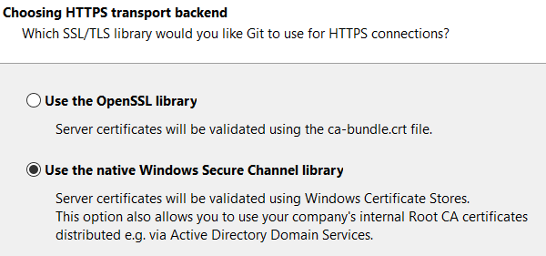

第一个选项是使用 OpenSSL 库服务器证书将使用 ca-bundle.crt 文件进行验证。
第二个选项是使用本机 Windows 安全通道库。
个人用户选择第二个选项就行。

接下来进入Git如何处理文本文件的换行符的界面

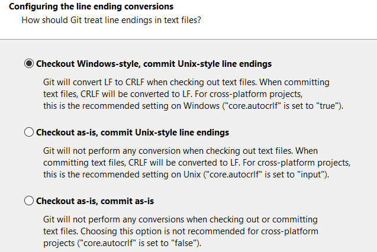

Linux / macOS 是类Unix的操作系统，它们之间的换行符的表示与Windows是不一样的，这时就会有一种问题，如果拉取的仓库是Linux上开发的，它的部分文本语法格式与Windows的语法不一致。

第一个选项是从仓库下载代码时将文件转换为Windows的格式，让你的文本编辑器显示正常，提交到仓库时将文本格式又重新转换为Linux的风格。

第二个选项是下载时不转换,提交时才转换。

第三个选项是完全不做任何转换。

这里推荐选择第一个选项。

接下来选择`Git Bash`的终端模拟器

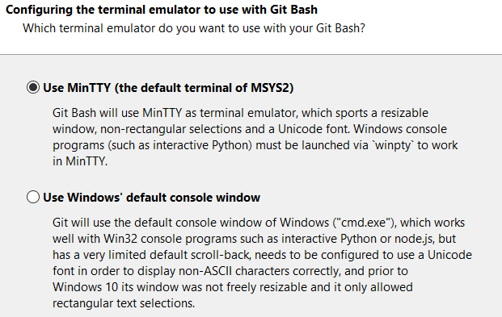

第一个是选择MinTTY作为默认的Git的终端模拟器

第二个是使用Windows的cmd作为Git的终端模拟器

选择第一个，Windows11都已经将Windows终端作为了默认的终端模拟器，连Windows自己都快抛弃cmd了。

接下来是选择你的 git pull 行为

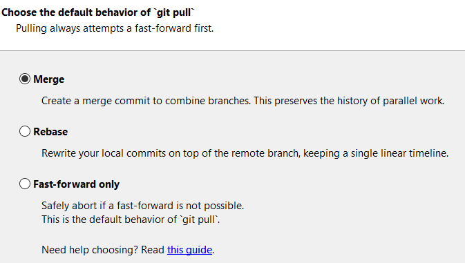

第一个选项是合并时创建一个合并提交,保留分支历史。

第二个选项是把你的本地提交挪到远程提交之后。

第三个选项是你本地没有新提交时才拉取,否则直接中止报错。

选择默认的第一个选项。

接下来进入是否需要安装凭据助手界面

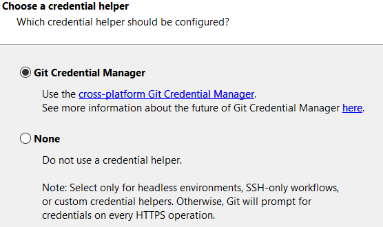

如果有经常 git pull 的需求，可以选择第一个选项，会在第一个 git pull 时进入认证，后续就不需要认证了。第二个选项是不安装凭据助手，每次操作都要重新输入用户名和凭据。这里我选择第一个选项。

接下来进入配置额外功能界面

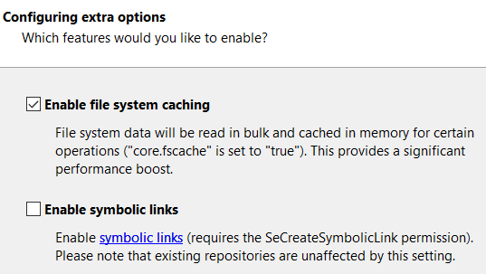

第一个选项是启用文件系统缓存，这样的话 Git 会批量读取文件信息并缓存在内存里,而不是反复扫描磁盘，这是一个性能优化，建议启用。

第二个选项是启用符号链接，Linux/macOS 上很常见,但 Windows 上可能遇到权限问题，不建议启用。

最后开始进入安装，安装结束后启用Windows终端输入`git --version`,打印出版本号说明已经安装成功。

```
PS C:\Users\Ayazuki\Desktop> git --version
git version 2.56.0.windows.1
```

在使用 Git 之前，进行本地配置是非常重要的一步，可以在Windows终端中执行以下命令进行本地配置。

```
# 配置用户名
git config --global user.name "你的英文名"
# 配置邮箱
git config --global user.email "你的邮箱@example.com"
```

把引号里的内容换成你的信息即可

每次的提交里强制包含作者信息，这样可以在历史中看到是谁在什么时间提交了什么改动，这是一个署名的用途，代码历史必须可追溯、可问责。所以 Git 拒绝在没有配置身份的情况下提交代码。

在终端中执行`git config --global --list`可以查询本地的git配置信息，也可以在`C:/Users/你的用户名/.gitconfig`中进行查看和修改。
