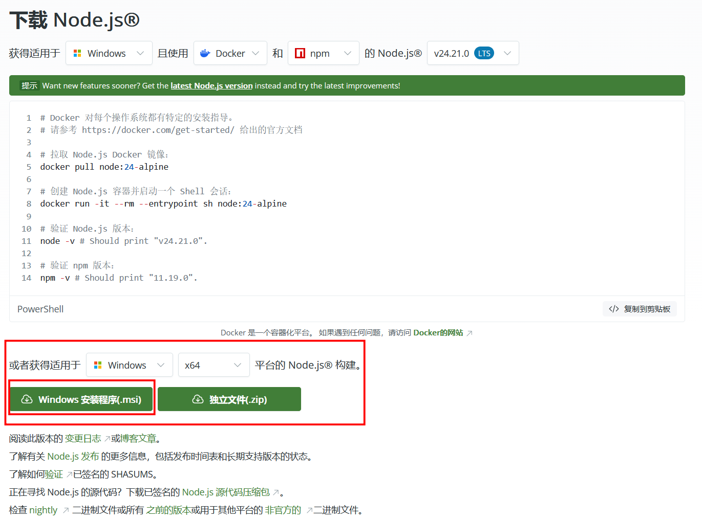
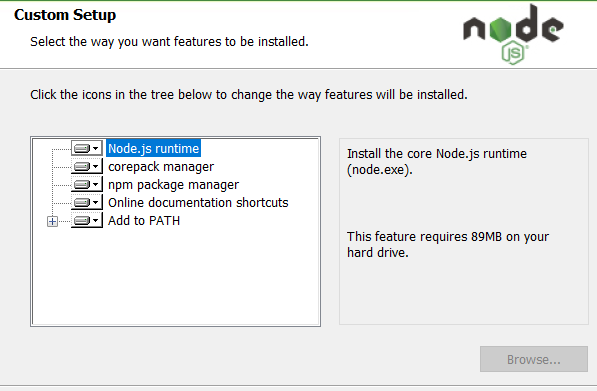
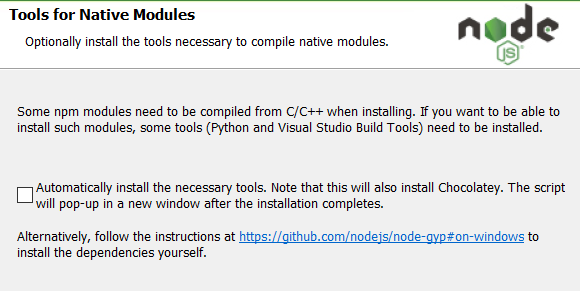

# 为什么要安装node.js

目前很多的Agent工具都提供了npm的安装包，npm是一个跨平台的包管理器，学会在Windows上配置node.js和使用npm安装Agent工具对未来在Linux上配置Agent工具也有帮助。

# 安装node.js

首先来到[node.js的官网](https://nodejs.org/zh-cn)点击**获取node.js**，按照自己的需求进行下载，这里我一般不在Windows使用Docker，所以选择第二个选项下载Windows安装程序(.msi)



执行已经下载好的`node-v24.21.0-x64.msi`安装程序，同意许可证以及选择适合自己的下载路径，接下来进入常规安装页面，默认是全部勾选了下面五个五个选项



第一个选项是Node.js的核心程序

第二个选项是包管理器工具

第三个选项是npm 包管理器

第四个选项是创建一个nodejs的在线文档的快捷方式，可不选

第五个是添加到环境变量

我这里只不选择第四个选项，Next

接下来进入原生模块编译工具界面



这个是要不要安装一套用来编译 C/C++ 原生模块的工具链（包括 Python、Visual Studio Build Tools，以及 Chocolatey 这个 Windows 包管理器。

如果有这方面的需求可以选上，目前我没有这方面的需求，所以不选，如果后续有需求的话在安装。

最后开始执行正式安装，安装完成后打开Windows终端，输入`node --version`和`npm --version`打印出对应的版本号说明node.js已经安装完毕。

```
PS C:\Users\Ayazuki\Desktop> node -v
v24.21.0
PS C:\Users\Ayazuki\Desktop> npm --version
11.19.0
```


