这里我推荐的Coding Agent是Pi

# 为什么选择Pi

Pi官方的回答是 Pi 是一个极简的智能体运行框架。让 Pi 适应你的工作流，而不是反过来。你可以用扩展、技能、提示词模板和主题来自定义 Pi。我推荐Pi的原因是现在随着模型的能力越来越强大，价格越来越高，为此需要找一个简单可靠没有大量预设的提示词的Coding Agent来节省token，Pi它预设提示词很少，token的消耗相比于其余的Coding Agent会少一些。目前市场上关于TUI的Agent普遍都是英文，Pi是开源的，可以按照自己的喜好通过拓展来自定义它，就比如通过Pi接入大模型来制作汉化Pi的拓展，Pi 能讲解自己的功能并查阅自己的文档，直接问它怎么用 Pi 或怎么给 Pi 写拓展。在这个时代，大模型给想象力插上了翅膀，通过定制Pi来打造属于自己的独一无二的Coding Agent。

# 安装Pi

首先来到[Pi的官网](https://pi.dev/),找到对应的npm安装包的下载命令,复制下来。

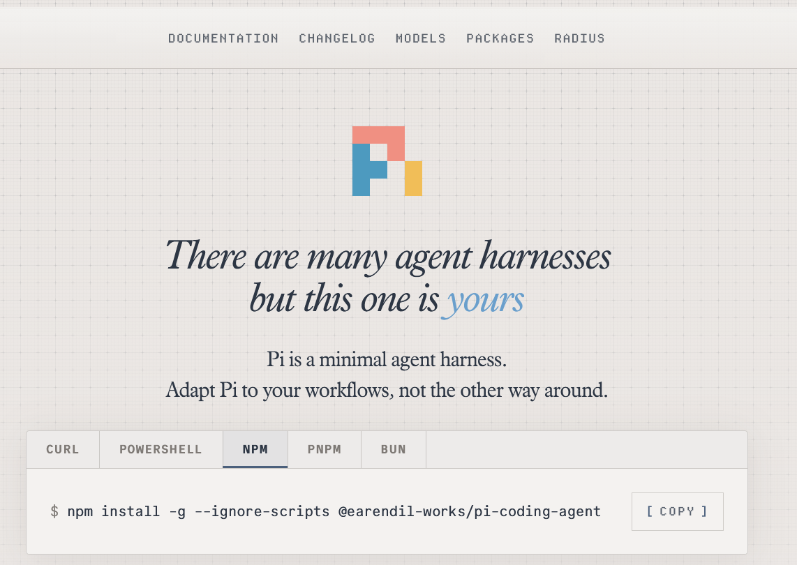

打开Windows终端，粘贴安装命令并回车执行，等候安装完成，安装完成后在终端输入`pi --version`,打印出版本号说明安装完成。

```
PS C:\Users\Ayazuki\Desktop> npm install -g --ignore-scripts @earendil-works/pi-coding-agent
npm warn deprecated node-domexception@1.0.0: Use your platform's native DOMException instead

added 147 packages in 24s

9 packages are looking for funding
  run `npm fund` for details
npm notice
npm notice New major version of npm available! 11.19.0 -> 12.2.0
npm notice Changelog: https://github.com/npm/cli/releases/tag/v12.2.0
npm notice To update run: npm install -g npm@12.2.0
npm notice
PS C:\Users\Ayazuki\Desktop> pi --version
1.0.0
```

`npm warn deprecated node-domexception@1.0.0`;某个依赖包版本过旧的警告，只是提示，并不影响使用。

`added 147 packages in 24s`:安装成功！这个工具连同它的 147 个依赖包已经全部装好。

`9 packages are looking for funding`:有 9 个包作者在"求打赏"，纯属自愿，可以无视。

`npm notice ... New major version of npm available`:提示 npm 有新版本（12.2.0）。不是必须更新。

在指定工作目录启动Windows终端，输入`pi`即可启动

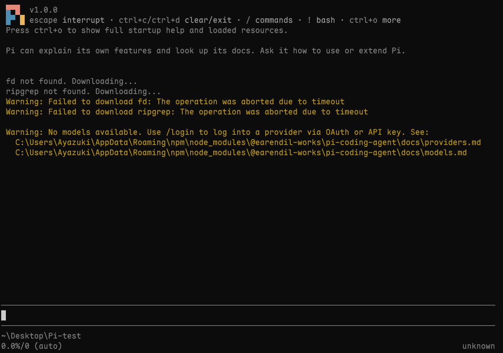

这里提示我没有找到fd和ripgrep，需要下载，受限于国内网络环境给出了两个下载超时的警告，这里的fd是超快的文件查找工具，ripgrep是超快的文本搜索工具。

可以另开一个终端尝试使用winget来下载

```
winget install BurntSushi.ripgrep.MSVC
winget install sharkdp.fd
```

这次运气很好下载成功了

```
PS C:\Users\Ayazuki\Desktop> winget install BurntSushi.ripgrep.MSVC
“msstore”源要求在使用前查看以下协议。
Terms of Transaction: https://aka.ms/microsoft-store-terms-of-transaction
源要求将当前计算机的 2 个字母的地理区域发送到后端服务才能正常工作，(例如"US")。

是否同意所有源协议条款?
[Y] 是  [N] 否: Y
已找到 RipGrep MSVC [BurntSushi.ripgrep.MSVC] 版本 15.2.0
此应用程序由其所有者授权给你。
Microsoft 对第三方程序包概不负责，也不向第三方程序包授予任何许可证。
正在下载 https://github.com/BurntSushi/ripgrep/releases/download/15.2.0/ripgrep-15.2.0-x86_64-pc-windows-msvc.zip
  ██████████████████████████████  1.70 MB / 1.70 MB
已成功验证安装程序哈希
正在提取存档...
已成功提取存档
正在启动程序包安装...
已修改路径环境变量；重启 shell 以使用新值。
添加了命令行别名： "rg"
已成功安装
PS C:\Users\Ayazuki\Desktop> winget install sharkdp.fd
已找到 fd [sharkdp.fd] 版本 10.5.0
此应用程序由其所有者授权给你。
Microsoft 对第三方程序包概不负责，也不向第三方程序包授予任何许可证。
此包需要以下依赖项：
  - 程序包
      Microsoft.VCRedist.2015+.x64
正在下载 https://github.com/sharkdp/fd/releases/download/v10.5.0/fd-v10.5.0-x86_64-pc-windows-msvc.zip
  ██████████████████████████████  1.46 MB / 1.46 MB
已成功验证安装程序哈希
正在提取存档...
已成功提取存档
正在启动程序包安装...
已修改路径环境变量；重启 shell 以使用新值。
添加了命令行别名： "fd"
已成功安装
```

下载完成后关闭全部终端，在工作路径新开一个终端启动pi

此时还剩下一个没有模型可用的警告，需要使用`/login`接入已有的API

```
 Select authentication method:

 → Sign in with an account
   Sign in with an API key
   Sign in with Radius • not configured
```

第一个是使用账户接入，第二个是使用API key 接入，第三个是1.0新增接入，应该是pi要自己卖token了。

注意国内的模型提供商有CN后缀的，如果买的服务是国内的就是接入CN后缀的，比如Qwen的token就有三个选项

```
 → Qwen Token Plan • not configured
   Qwen Token Plan CN • not configured
   Qwen Token Plan Individual • not configured
```

第一个是千问国际团队版，第二个是千问国内版，包含企业版和个人版，第三个是千问国际个人版。一般去国际站点买的是国际版，美元结算，面向给国际用户。国内的服务一般是人民币结算。

我这里选择使用API key接入，搜索deepseek，回车，接入自己的API key，回车确认，接入成功后右下角会显示模型名称以及思考等级。默认思考等级是全部关闭的

输入`/model`或使用快捷键Ctrl+p 可以切换模型，输入`/thinking`可以调整模型思考等级。

# Pi的配置

### 技能的配置

在`C:\Users\你的用户名\`路径下新建一个文件夹叫`.agents`在这个文件夹下新建一个叫skills的文件夹，在这个skills文件夹下放置自己的技能，然后重启pi，重启后pi就会自动发现这些技能了。

```
[Skills]
  academic-paper, academic-paper-reviewer, brainstorming, chinese-summary, deep-research,
executing-plans, nature-academic-search, nature-citation, nature-polishing, nature-response,
nature-reviewer, nature-shared, nature-writing, pdf, requesting-code-review, research-figure-for-latex,
say-chinese, subagent-driven-development, systematic-debugging, ui-ux-pro-max, writing-plans
```

某些技能可能需要依赖才能运行，以上述技能为例介绍配置技能依赖

##### 各技能用途速览

| 技能                                | 用途                                                                                    |
| ----------------------------------- | --------------------------------------------------------------------------------------- |
| **academic-paper**                  | 12 智能体学术论文写作流水线，11 种模式、6 种论文类型、5 种引文格式，LaTeX/DOCX/PDF 输出 |
| **academic-paper-reviewer**         | 模拟 5 位审稿人（主编+3 同行+魔鬼代言人）的多视角论文评审                               |
| **deep-research**                   | 13 智能体通用深度研究：文献检索、系统综述、元分析、事实核查、PRISMA                     |
| **nature-academic-search**          | 多源文献检索（PubMed/CrossRef/arXiv/Scopus）、引文核对、严格他引审计、引文文件转换      |
| **nature-citation**                 | 为正文自动匹配 Nature/CNS 及子刊支撑文献，导出 RIS/EndNote/Zotero 文件                  |
| **nature-writing**                  | 从零起草 Nature 风格稿件章节、投稿材料包（cover letter、highlights 等）                 |
| **nature-polishing**                | 学术英文润色至 Nature 风格，含 LaTeX 排版修复                                           |
| **nature-response**                 | 返修材料包：逐点回复信、rebuttal、标红修改稿、LaTeX 模板                                |
| **nature-reviewer**                 | Nature 风格投稿前预审，3 份审稿报告+交叉综合                                            |
| **nature-shared**                   | 内部共享参考包，供上面 4 个 nature-* 技能调用，不独立触发                               |
| **pdf**                             | PDF 全能处理：提取文本/表格、合并拆分、旋转水印、加密、表单、OCR                        |
| **research-figure-for-latex**       | 用 TikZ 生成出版级论文配图（流程图、架构图），编译并迭代                                |
| **ui-ux-pro-max**                   | UI/UX 设计指导：新界面生成、设计系统令牌、组件规范、前端代码改动                        |
| **brainstorming**                   | 任何创造性工作前的需求/设计探索，终态衔接 writing-plans                                 |
| **writing-plans / executing-plans** | 写多步骤实施计划 / 带审查检查点执行计划                                                 |
| **subagent-driven-development**     | 将实施计划中相互独立的任务分派给子代理执行                                              |
| **requesting-code-review**          | 完成任务/合并前派发代码审查                                                             |
| **systematic-debugging**            | 遇 bug/测试失败时的系统化调试方法论                                                     |
| **chinese-summary / say-chinese**   | 中文自然段总结 / 中文语言偏好设置                                                       |

##### 需要配置依赖的技能

| 技能                          | 依赖                                                                                                                                                                        |
| ----------------------------- | --------------------------------------------------------------------------------------------------------------------------------------------------------------------------- |
| **academic-paper**            | Python 3 + `pyyaml` + `jsonschema`（脚本另用到 `ruamel.yaml`）；DOCX 需 **Pandoc**；PDF 需 **LaTeX 发行版**；可选 matplotlib/R 出图                                         |
| **academic-paper-reviewer**   | 同属 ars 仓库，辅助检查脚本需 Python + pyyaml + jsonschema（核心评审本身纯提示词驱动）                                                                                      |
| **deep-research**             | 同上 Python 库；文献检索需**联网**（内置 crossref/openalex/arxiv 客户端）                                                                                                   |
| **nature-academic-search**    | **配置最重**：首选 MCP server（需 `mcp`、`requests`、`toml`、`lxml`、`pybliometrics` 等 Python 包 + PubMed 邮箱配置 + Scopus 需 API key）；降级路径为纯 stdlib 脚本但需联网 |
| **nature-citation**           | 脚本纯 stdlib，但需**联网**访问 CrossRef（断网时只能走纯人工流程，质量降级）                                                                                                |
| **pdf**                       | Python 库 `pypdf`/`pdfplumber`/`reportlab`（OCR 另需 pytesseract+pdf2image+Tesseract）；CLI 工具 poppler/qpdf/pdftk                                                         |
| **research-figure-for-latex** | 必需 **pdflatex**（MiKTeX/TeX Live）；PNG 预览需 pdftoppm/Ghostscript/ImageMagick 任一                                                                                      |

### 安装相关依赖

首先是配置Latex

首先来到[清华开源镜像网站](https://mirrors.tuna.tsinghua.edu.cn)进行Latex的下载，在镜像站首页点击**获取下载链接**按钮，点击**应用软件**按钮，下拉页面找到**TeX 排版系统**，选择`TeX Live 2026 (Windows & Linux)`进行下载。文件很大，6.3G左右，是一个ISO文件。

**TeX Live 2026**：最主流的 TeX 发行版，包含所有宏包和编译工具，支持 Windows 和 Linux，学术圈标准配置

**MiKTeX**：另一个发行版，特点是"按需安装宏包"，体积更小。

**MacTeX**：TeX Live 的 macOS 定制版。

**TeXstudio**：最流行的免费 LaTeX 编辑器，有语法高亮、一键编译、PDF 预览、公式预览等功能。

这个LaTeX编辑器可以使用VScode+LaTeX Workshop插件的方式替代。

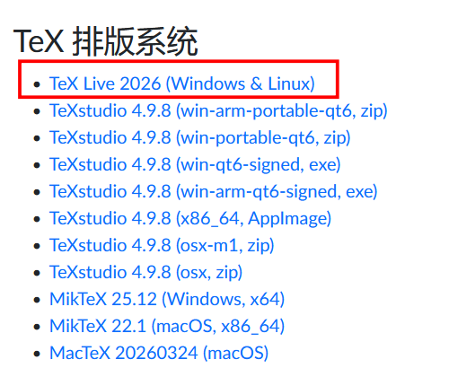

双击下载好的文件`texlive2026-20260301.iso`进入目录，找到 `install-tl-windows.bat`，右键选择 **“以管理员身份运行”**。可以更换安装根目录，但是确保安装路径不存在中文或空格。
此时会进入TeX Live的GUI安装页面

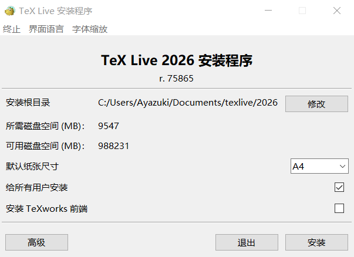

安装目录按照自己的喜好来选择，确保磁盘空间充足，因为会采用VScode+插件作为Latex编辑器，所以就不安装TeXworks前端了。然后开始安装，这个安装过程会很漫长，等候安装完成即可。
出现下面的页面时算是安装完成了，此时关闭按钮可以点击。

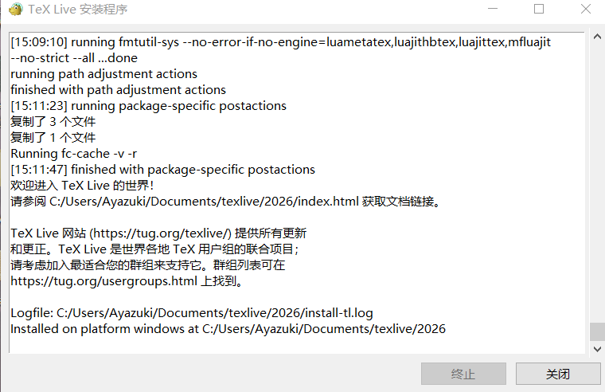

最后在Windows终端上输入`tex --version`，输出版本号说明安装成功。

```
PS C:\Users\Ayazuki\Desktop> tex --version
TeX 3.141592653 (TeX Live 2026)
kpathsea version 6.4.2
Copyright 2026 D.E. Knuth.
There is NO warranty.  Redistribution of this software is
covered by the terms of both the TeX copyright and
the Lesser GNU General Public License.
For more information about these matters, see the file
named COPYING and the TeX source.
Primary author of TeX: D.E. Knuth.
PS C:\Users\Ayazuki\Desktop>
```

安装VScode

前往[VScode官网](https://code.visualstudio.com/)下载VScode的安装包

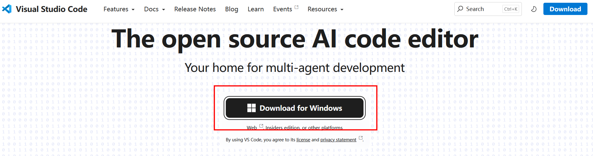

运行`VSCodeUserSetup-x64-1.140.0.exe`进行安装

安装路径和附加任务按照自己的喜好进行

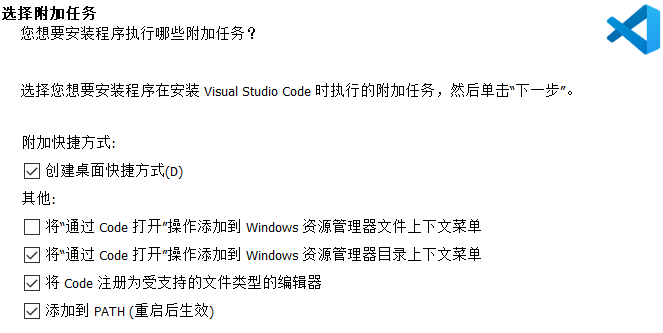

启动VScode，可以选择不登陆账户，如果后续有需要可以登录自己的账户

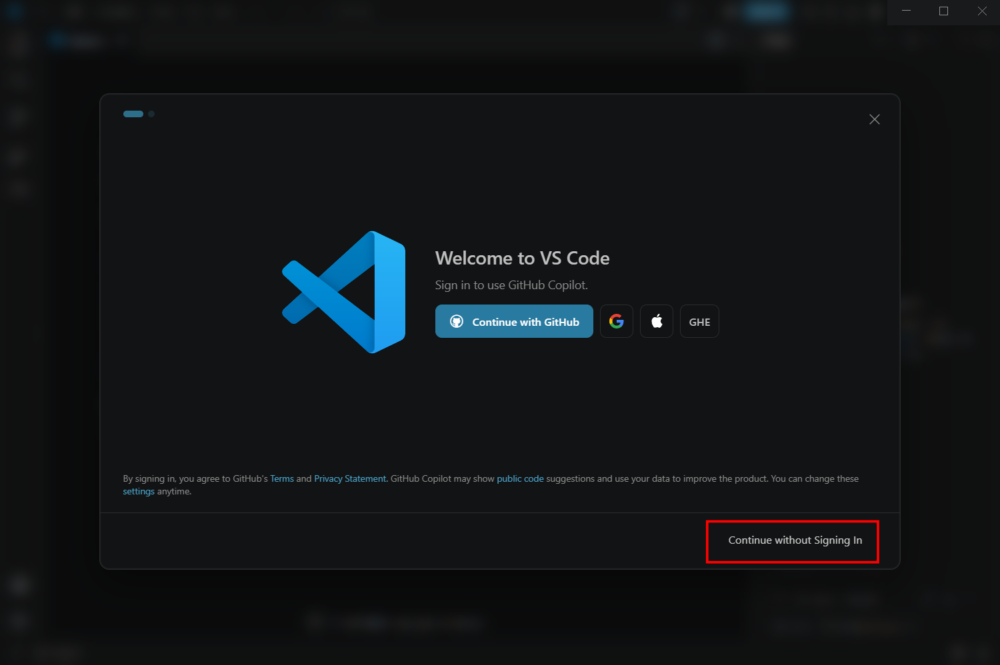

选择自己喜欢的主题，然后Get Started

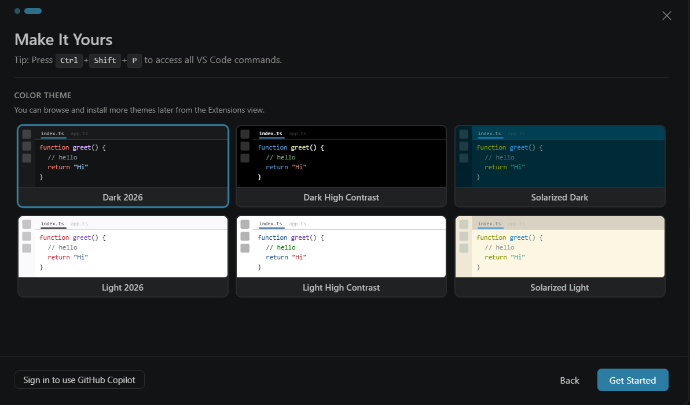

找到拓展

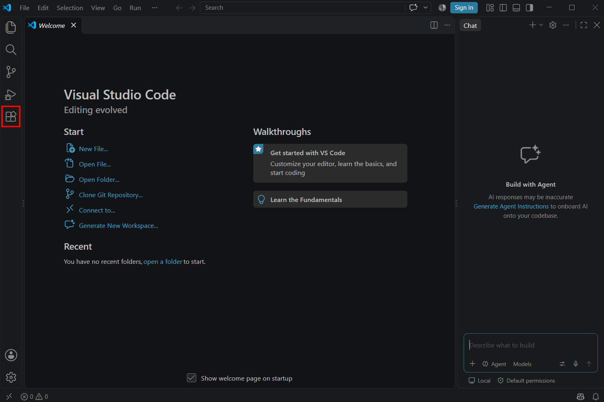

首先对VScode进行汉化，在拓展中搜索`chinese`安装汉化拓展

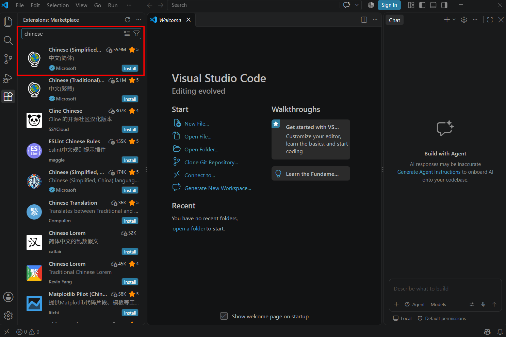

安装完成后右下角有个弹出重启VScode即可让汉化生效

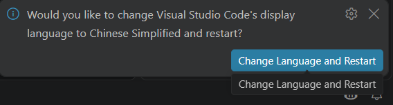

重启VScode后继续来到拓展，搜索`LaTeX Workshop`进行安装，选择信任插件作者来安装该插件
安装完毕需要进行相关的的配置才能编译Latex。找到左下角的齿轮图标，找到设置

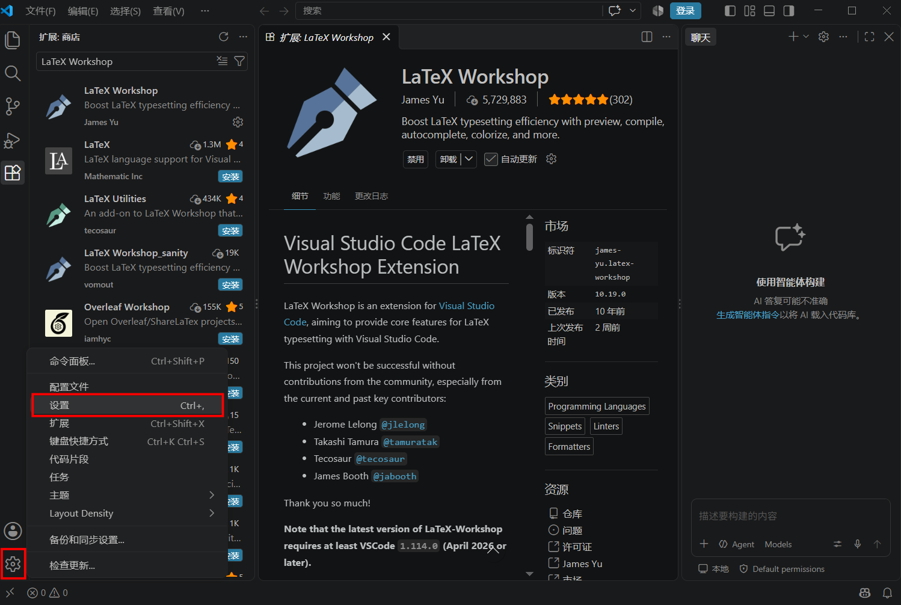

选择打开设置json文件

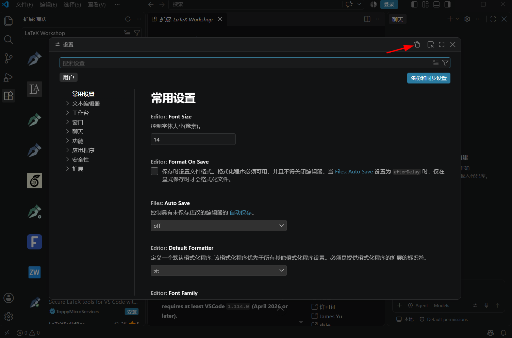

将以下配置填充到设置的json的{}中并保存

```
     // ==================== LaTeX Workshop 核心配置 ====================
    // 1. 定义编译工具
    "latex-workshop.latex.tools": [
        {
            "name": "latexmk",
            "command": "latexmk",
            "args": [
                "-synctex=1",
                "-interaction=nonstopmode",
                "-file-line-error",
                "-pdf",
                "-xelatex",   // 关键：使用 xelatex 引擎
                "-outdir=%OUTDIR%",
                "%DOC%"
            ]
        },
        {
            "name": "xelatex",
            "command": "xelatex",
            "args": [
                "-synctex=1",
                "-interaction=nonstopmode",
                "-file-line-error",
                "-shell-escape", // 允许执行 shell 命令，部分宏包需要
                "%DOC%"
            ]
        }
    ],
    // 2. 定义编译链 (recipes)
    "latex-workshop.latex.recipes": [
        {
            "name": "latexmk (xelatex)", // 推荐，最自动化
            "tools": ["latexmk"]
        },
        {
            "name": "xelatex -> bibtex -> xelatex*2", // 处理参考文献的链
            "tools": ["xelatex", "bibtex", "xelatex", "xelatex"]
        },
        {
            "name": "xelatex",
            "tools": ["xelatex"]
        }
    ],
    // 设置默认编译链为最推荐的 latexmk
    "latex-workshop.latex.recipe.default": "latexmk (xelatex)",
    
    // ==================== 编译与清理设置 ====================
    // 保存文件时自动编译
    "latex-workshop.latex.autoBuild.run": "onSave",
    // 编译失败时自动清理临时文件
    "latex-workshop.latex.autoClean.run": "onFailed",
    // 清理临时文件的类型
    "latex-workshop.latex.clean.fileTypes": [
        "*.aux", "*.bbl", "*.blg", "*.idx", "*.ind", "*.lof", 
        "*.lot", "*.out", "*.toc", "*.acn", "*.acr", "*.alg", 
        "*.glg", "*.glo", "*.gls", "*.ist", "*.fls", 
        "*.log", "*.fdb_latexmk", "*.bcf", "*.run.xml"
    ],
    
    // ==================== PDF 预览设置 ====================
    // 在 VSCode 新标签页中打开 PDF
    "latex-workshop.view.pdf.viewer": "tab",
    // 启用正向和反向搜索 (按住 Ctrl/Cmd 并点击PDF可跳转到代码)
    "latex-workshop.view.pdf.internal.synctex.keybinding": "ctrl-click",
    
    // ==================== 辅助功能 ====================
    // 在资源管理器侧边栏显示结构
    "latex-workshop.showContextMenu": true,
    // 生成章节等环境的代码补全提示
    "latex-workshop.intellisense.citation.backend": "biblatex",
    "latex-workshop.intellisense.citation.format": "latex",
    // 让错误弹窗更简洁
    "latex-workshop.message.error.show": false,
    "latex-workshop.message.warning.show": false,
    "workbench.editorAssociations": {
        "*.pdf": "latex-workshop-pdf-hook",
        "*.svg": "cweijan.officeViewer",
        "*.csv": "default",
        "*.md": "vscode.markdown.editor"
    },
    "update.enableWindowsBackgroundUpdates": false,
    "update.titleBar": false,
    "update.showReleaseNotes": false,
    "vscode-office.editorTheme": "Solarized",
    "security.workspace.trust.untrustedFiles": "open"
```

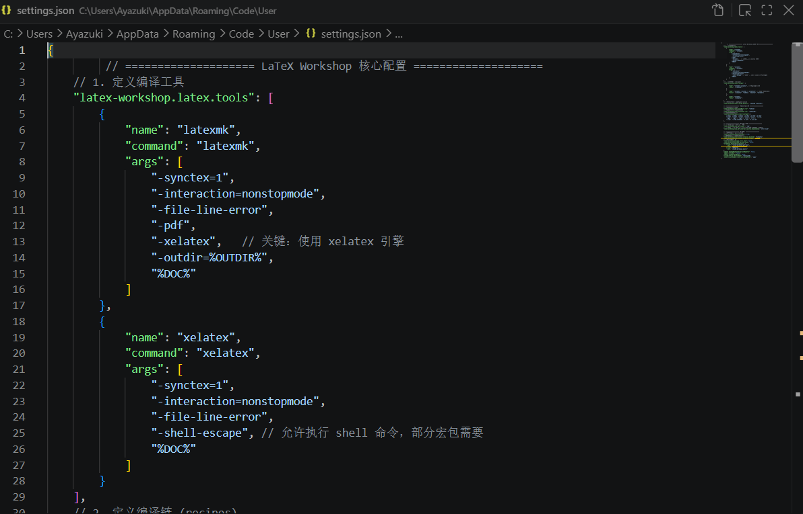

重启VScode，然后接下来新建一个的文件夹来测试Latex编译是否正常

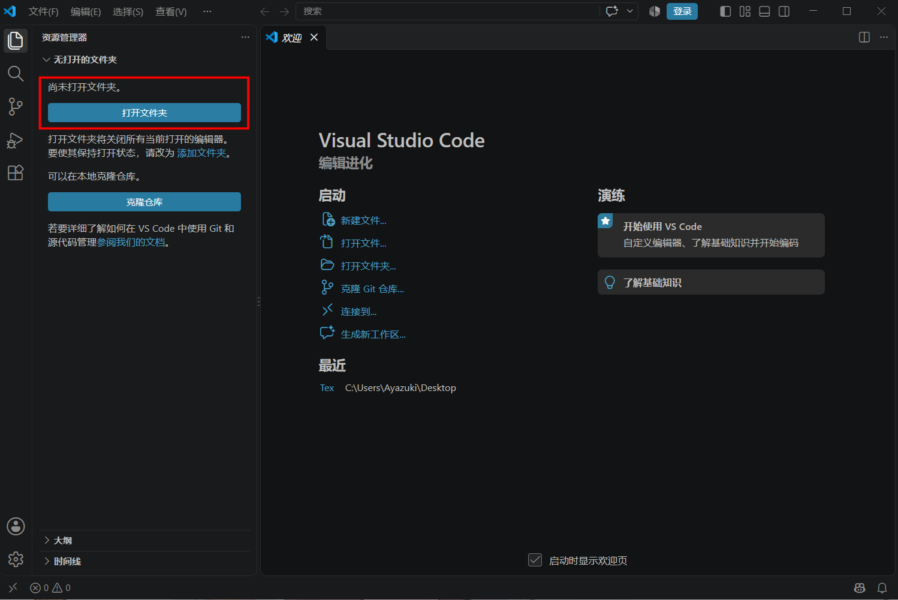

打开文件夹后会提示一个权限问题，点击上方的`管理`

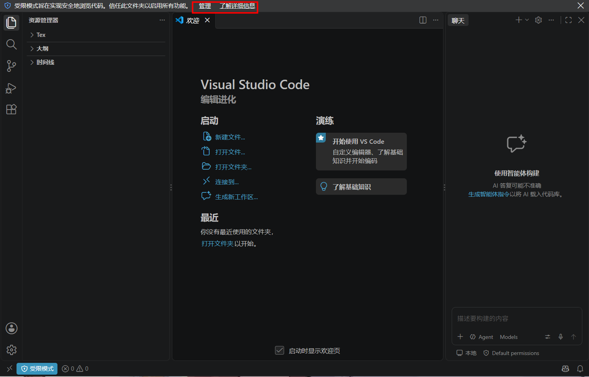

选择信任

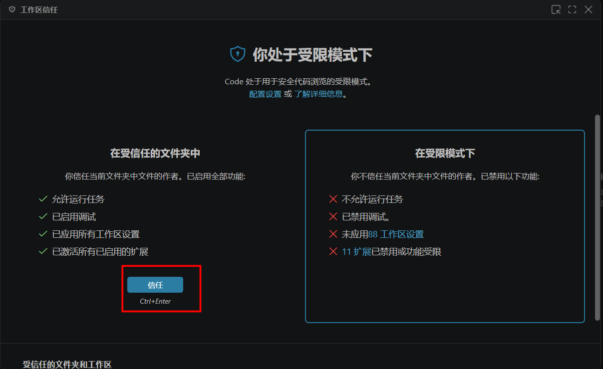

新建一个hello.tex 文件

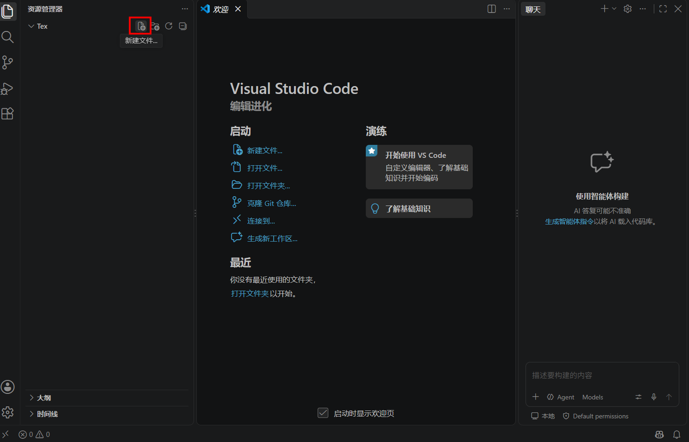

将下面信息复制到该文件中并保存

```
% !TEX program = xelatex
\documentclass[12pt]{ctexart}

\title{我的第一个 LaTeX 文档}
\author{你的name}
\begin{document}

\maketitle

\section{正文}
你好，世界！这是我用 VSCode 编写的第一份 LaTeX 文档。

\section{数学公式}
$f(x)=a+b$

\end{document}
```

开始构建

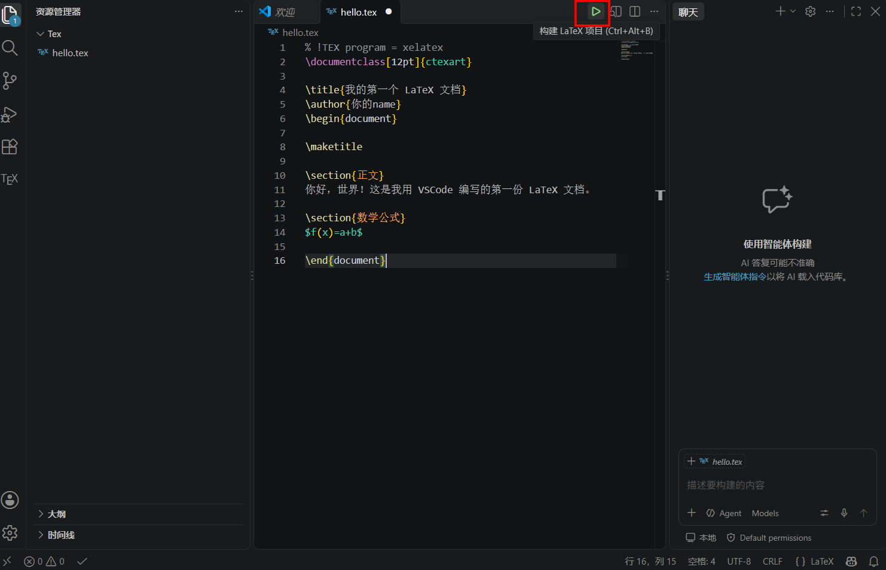

构建完成

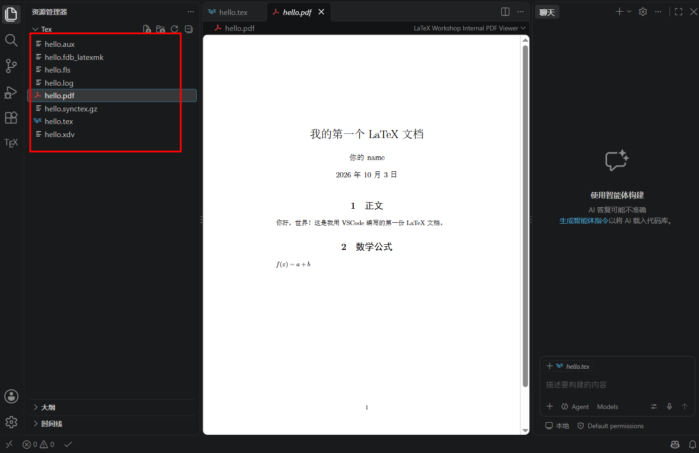

接下来配置`pandoc`

pandoc是一个文档格式转换工具，可以让Markdown → PDF / Word / HTML，也可以让Word（docx）→ Markdown / LaTeX，还可以LaTeX → Word / HTML 等等。

直接到[官方的github仓库](https://github.com/jgm/pandoc)下载发行版即可

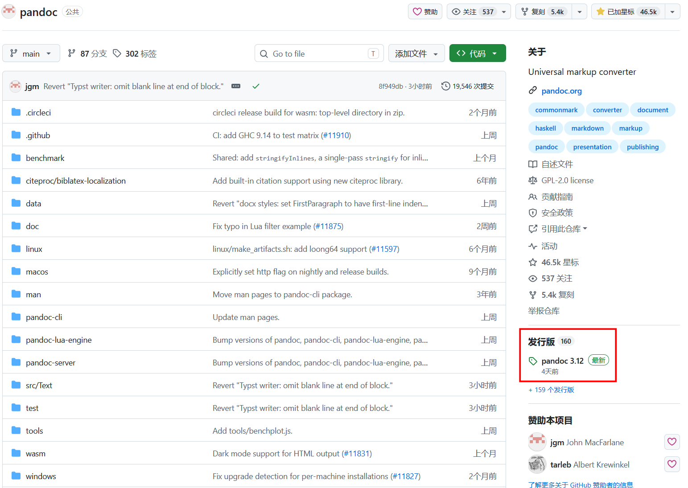

下拉到资源找到`pandoc-3.12-windows-x86_64.msi`进行下载安装包

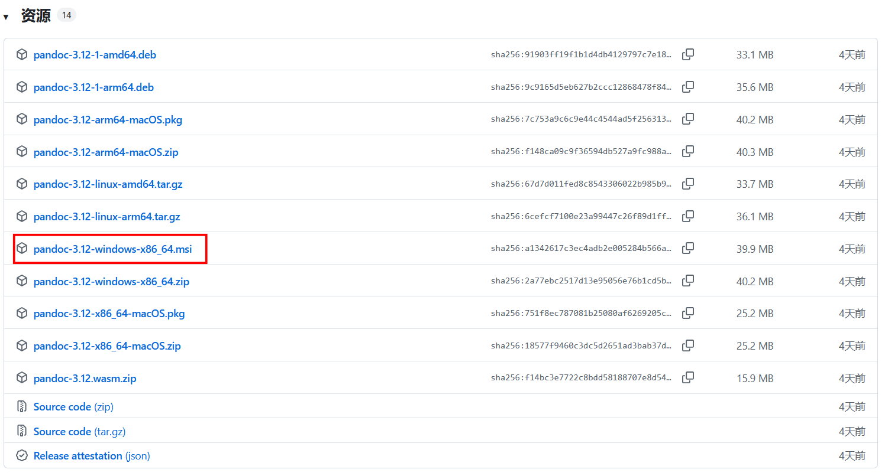

后缀为`amd.deb`的包是64位Linux的debian系发行版的安装包
后缀为`macOS`是提供给mac系统的安装包
后缀为`linux-amd64.tar.gz`的是64位Linux所有通用发行版的压缩包，解压使用
`pandoc-3.12-windows-x86_64.msi`是安装包，`pandoc-3.12-windows-x86_64.zip`是压缩包，解压使用。

`pandoc-3.12.wasm.zip`是编译成 WebAssembly 的版本，可以在浏览器里运行 Pandoc

执行下载好的`pandoc-3.12-windows-x86_64.msi`进行安装
选择只给当前用户安装或选择给机器的所有用户安装根据自己的习惯来，这个程序是默认安装到C盘，没有给安装路径的选择。

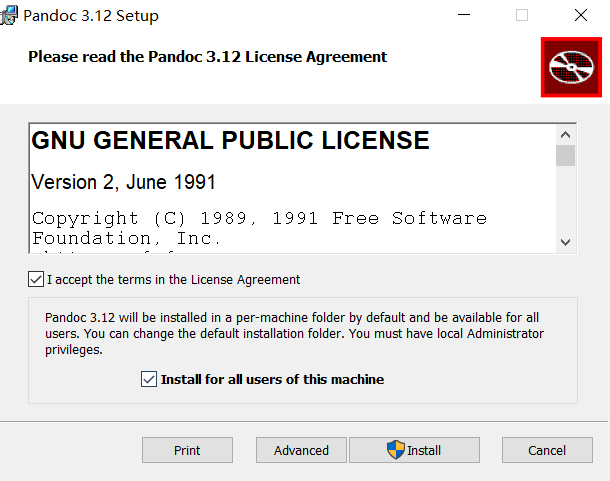

安装完成后启动Windows终端输入`pandoc --version`,打印出版本号说明以及安装成功。

```
PS C:\Users\Ayazuki\Desktop> pandoc --version
pandoc 3.12
Features: +server +lua
Scripting engine: Lua 5.4
User data directory: C:\Users\Ayazuki\AppData\Roaming\pandoc
Copyright (C) 2006-2025 John MacFarlane. Web:  https://pandoc.org
This is free software; see the source for copying conditions. There is no
warranty, not even for merchantability or fitness for a particular purpose.
```

最后对系统级Python 进行下载第三方库来解决调用技能缺少依赖的问题

之前给pip已经更换了清华源，直接在Windows终端上执行以下命令来安装相关依赖

`pip install pyyaml jsonschema ruamel.yaml pypdf pdfplumber reportlab matplotlib pandas pytesseract pdf2image defusedxml requests pytest defusedxml "mcp>=1.0.0,<2.0.0" "requests>=2.28.0,<3.0.0" "toml>=0.10.2,<2.0.0" "lxml>=4.9.0,<6.0.0" "pybliometrics>=4.4.1,<5.0.0" `

注意：后面的五个包是`nature-academic-search`要求的，当python版本号为3.14时可能会出现报错，目前我的系统级python为3.13.16，安装这些依赖包并没有出现问题。

最后开始配置`nature-academic-search`要求的MCP配置，在Pi0.99版本加入了对MCP的原生支持，直接在`C:\Users\你的用户名\.pi\agent\`下创建`mcp.json`文件，将以下内容填写入该文件

```json
   {
     "mcpServers": {
       "academic-search": {
         "command": "python",
         "args":
 ["C:\\Users\\你的用户名\\.agents\\skills\\nature-academic-search\\mcp-server\\academic_search_server.py"],
         "timeout": 120,
         "exposure": "direct",
         "description": "CrossRef/PubMed/arXiv/Scopus/ScienceDirect 多源学术检索"
       }
     }
   }
```

配置完成后在Windows终端新开一个pi，输入`/mcp`命令，显示academic-search说明已经配置成功

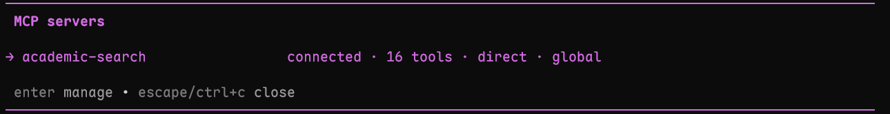

### Pi拓展的配置

接下来开始汉化Pi，在`C:\Users\你的用户名\.pi\agent`路径下新建extensions文件夹，将zh-for-pi拓展放入，在pi中输入`/reload`重新加载，这时候pi就能识别到新增的zh-for-pi拓展了，输入`/update-zh-for-pi`开始进行汉化，截止到2026年10月3日，我已经将汉化拓展覆盖到pi的1.0.0版本了，后续每次pi更新都可以重新执行以下`/update-zh-for-pi`的命令，它会调用你当前会话的大模型进行汉化，汉化完毕后及时`/reload`，如果部分页面汉化不彻底，可以自行在Pi中与大模型进行探讨如何汉化。

zh-for-pi 拓展共注册了 **4 个斜杠命令**：

| 命令                | 定义位置      | 作用                                                              |
| ------------------- | ------------- | ----------------------------------------------------------------- |
| `/设置`             | index.ts:836  | 打开中文设置面板（与内置 `/settings` 对齐，34 项 + 3 个子菜单）   |
| `/快捷键`           | index.ts:804  | 在聊天区输出中文版快捷键表（三区 34 行，键位读真实生效绑定）      |
| `/tps`              | footer.ts:367 | 打开 TPS 交互设置菜单（显示模式 / Token 计数策略 / 服务商计数等） |
| `/update-zh-for-pi` | index.ts:860  | 注入汉化更新操作手册，由 agent 执行审计更新（即本次更新用的那个） |

可以在Pi中输入`/设置`来将Pi调整为自己喜欢的样子，输入`/快捷键`可以了解Pi是怎么使用的。

常用的快捷键有 `Ctrl+ j`换行，`tab`补全，`Esc`中断生成，`Shift+Tab`调整模型思考等级，`Ctrl+p`切换模型。

下面是我在pi中使用`Kimi K3`制作10个pi拓展，放入pi的extensions文件夹即可启用。

**ask-questions** — 结构化提问工具

- 给 Pi 增加 `ask_questions` 工具：需要用户输入时，弹出一个 TUI 问答流程（单/多问题、预设选项 + 自定义回答、提交前可回顾修改），答案以结构化数据返回。
- 用途：模型不再需要你手打长段回答，方向键选择即可。快捷键 `j/k` 移动、`1-9` 选项、`h/l` 切换问题、`Esc` 取消。

**subagent** — 子代理派发

- 注册 `subagent` 工具，支持三种模式：single（单个子代理）、parallel（并行多个）、chain（串行链式，`{previous}` 占位符传递上一结果）。

- 通过在`C:\Users\Ayazuki\.pi\agent`下放置`AGENTS.md`约束子代理默认强制继承主会话的模型和思考等级，质量优先。该`AGENTS.md`内容如下：

  ```
   全局规则
  
  ## 子代理模型选择（最高优先级，覆盖一切技能文档）
  
  **派发任何 subagent 时，禁止通过 `model` 参数指定其他模型或思考档位**——必须省略该参数，让子代理继承当前会话的模型与当前思考强度。质量优先，不做任何成本导向的模型降级。
  
  - 即使技能文档（如 subagent-driven-development 的 Model Selection 一节）要求按任务选便宜模型，也以本规则为准。
  - 用户切换会话模型/思考强度后，后续所有子代理自动跟随新配置。
  ```

- 子代理定义在 `~/.pi/agent/agents/*.md`。
  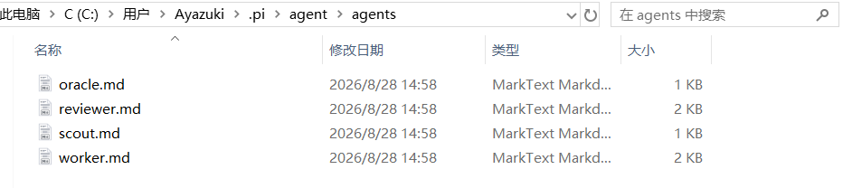

**todo** — 待办事项清单

- 注册 `todo` 工具（list/add/toggle/clear）给模型用，`/todos` 命令给你查看清单。
- 巧妙之处：状态存在会话条目（工具结果 details）而非外部文件，因此**切换会话分支时待办状态自动回滚到对应历史时间点**。

**permission-gate** — 危险命令闸门

- 在执行匹配 `rm`（任意）、`sudo`、`chmod/chown 777` 的 bash 命令前弹窗确认「允许/拒绝」；非交互模式（无 UI）默认直接拦截。

**plan-mode** — 只读计划模式

- `/plan` 开启或关闭。开启后禁用 `edit`/`write`，bash 只允许白名单只读命令，footer 显示「计划模式」状态；每轮 agent 回复后提示是否退出。用于安全的代码探索/方案讨论阶段。

**smart-selection** — 表格语义选择

- 解决 fullscreen 模式下在渲染后的 markdown 表格里拖拽只能得到线性文本跨度的问题：从单元格内起拖，选区自动按表格语义对齐——格内拖拽只圈该格文本，同列跨行拖拽锁定该列纵向选，跨列拖拽圈出矩形网格。松手复制出的是还原好的 markdown 源表格（自动拼回软换行、CJK 宽字符安全），而非框线字符。按住 Ctrl 拖拽退化为纯矩形选区，双击词选择保持原生；`/smart-selection off`可暂时关闭该拓展。`/smart-selection on`可重新打开该拓展，`/smart-selection status`查看该拓展的状态。

**prompt-history** — 跨会话提示词历史

- 重启 pi、开新会话后仍可用 `↑`/`↓` 回溯历史提示词（含 `/命令`、`!bash`）。全局共享一份 `history.jsonl`（就在扩展目录内，拷目录即迁移），上限 1000 条，未发送草稿自动保存/恢复。

**hidden-commands** — 隐藏补全菜单命令

- 从 `/` 补全菜单隐藏指定内置命令（配置文件 `hidden-commands.json`，修改后 `/reload` 生效）。命令本体不受影响，手打仍可调用。默认隐藏 `llama`（不用 llama.cpp 时纯属菜单噪音）。

**zh-for-pi** — 全面汉化包

1. `/设置`：全中文设置面板，与内置 `/settings` 完全对齐
2. 斜杠命令描述汉化（命令名不变）
3. `/快捷键`：中文快捷键表，读取真实生效键位
4. 中文 footer：中文字段 + 实时 TPS 速度（`/tps` 设置，合并自 pi-token-speed）
5. 中文启动页眉（logo 下方的快捷键提示与 onboarding 文案）
6. bash 工具结果块汉化（耗时、截断警告、展开提示，模型看到的文本仍是英文）
7. `/update-zh-for-pi`：pi 升级后一键同步汉化
8. 全屏模式「↓ 跳转到最新消息」提示汉化
9. `/mcp` 管理器全页面汉化（服务器列表、工具页、OAuth 登录页等）

它们之间还有协作：zh-for-pi 的补全项隐藏功能已拆分为独立的 hidden-commands；zh-for-pi footer 会把 plan-mode 的「计划模式」状态特殊显示在第一行。

**token-manager** — 管理和监控我的套餐用量

| 服务                   | 状态栏显示内容                       | 告警颜色                 |
| ---------------------- | ------------------------------------ | ------------------------ |
| **Kimi For Coding**    | 5 小时 / 7 天用量百分比 + 重置倒计时 | ≥80% 黄、≥95% 红、100% ⛔ |
| **DeepSeek 开放平台**  | 账户余额 ¥                           | <10 黄、<5 或 key 无效红 |
| **千问团队Token Plan** | 当前席位剩余 Credits + 重置时间      | 按已用百分比同上着色     |

状态栏会跟随当前使用的模型自动切换显示对应那一家的用量；用其他模型时不显示，不占地方。

管理界面：`/token-manager`

打开一个三页的全屏管理器（`↑↓`/`jk` 移动、`←→`/`hl` 翻页、`Enter` 选择、`Esc` 退出）：

1. **Kimi 用量页** — 多 API key 池：添加/删除/重命名 key、查看明文、手动刷新；选中某个 key 即热切换 `auth.json`，无需重启 pi 就可以做到一个 Kimi 账号额度跑满了，秒切下一个账号。
2. **DeepSeek 余额页** — 总额/赠金/充值明细 + 刷新。
3. **Token Plan 坐席页** — 查看"我的坐席"Credits 明细，配置 RAM AccessKey、绑定/换绑坐席（按 SeatId 记忆，坐席被回收会提示换绑）。

当前启用项的余额每 **3 分钟自动刷新**一次。

数据与安全

- 配置存在 `token-manager.keys.json`：Kimi key 池 + 阿里云 AK；DeepSeek 直接读 pi 的 `auth.json`。
- Token Plan 查询走的是非官方接口（ROA + HMAC-SHA1 签名），只需只读权限的 RAM AK，坐席 key（sk-sp-）本身不保存。

### Pi的MCP配置

接下来介绍一个联网搜索的MCP

Exa MCP是一款用于 AI 模型的语义搜索类 MCP（Model Context Protocol）工具，能够理解用户意图并自动搜索最新讨论、行业动态与博客内容。

[Exa MCP官网](https://exa.ai/mcp)中并没有给出Pi配置的方案，这里我们可以选择`other`,将信息复制下来在Pi粘贴复制下来的信息并描述我们的需求一并发送给大模型，使用`/plan`进入计划模式只读探讨，让大模型自己写一份关于Exa MCP在pi的配置。然后用户审核方案决定要不要执行。

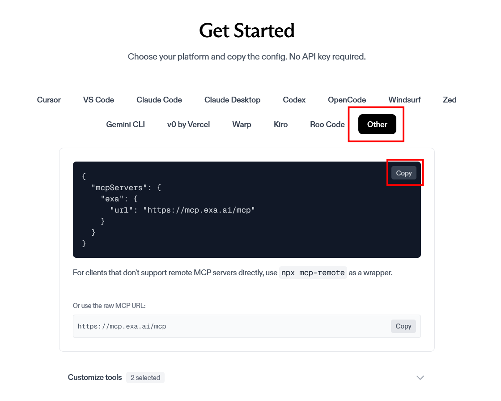

修改`C:\Users\Ayazuki\.pi\agent\mcp.json`文件为以下内容：

```
{
   "mcpServers": {
      "academic-search": {
         "command": "python",
         "args": [
            "C:\\Users\\你的用户名\\.agents\\skills\\nature-academic-search\\mcp-server\\academic_search_server.py"
         ],
         "timeout": 120,
         "exposure": "direct",
         "description": "CrossRef/PubMed/arXiv/Scopus/ScienceDirect 多源学术检索"
      },
      //新增以下内容来添加exa MCP,粘贴后请移除此行注释不然会报错
      "exa": {
         "url": "https://mcp.exa.ai/mcp",
         "exposure": "direct"
      }
   }
}
```

修改完毕后重启pi或`/reload`,输入`/mcp`,此时应该会发现`exa`MCP工具已注册

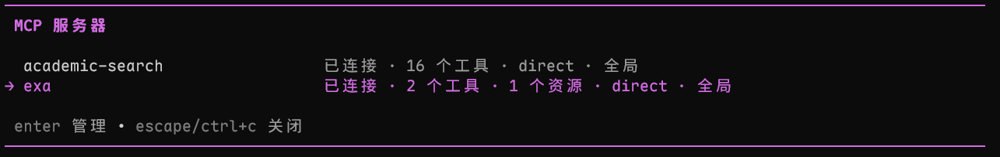

下面实际测试以下`exa`MCP是否能够正常调用以及了解`exa`对匿名用户的限制

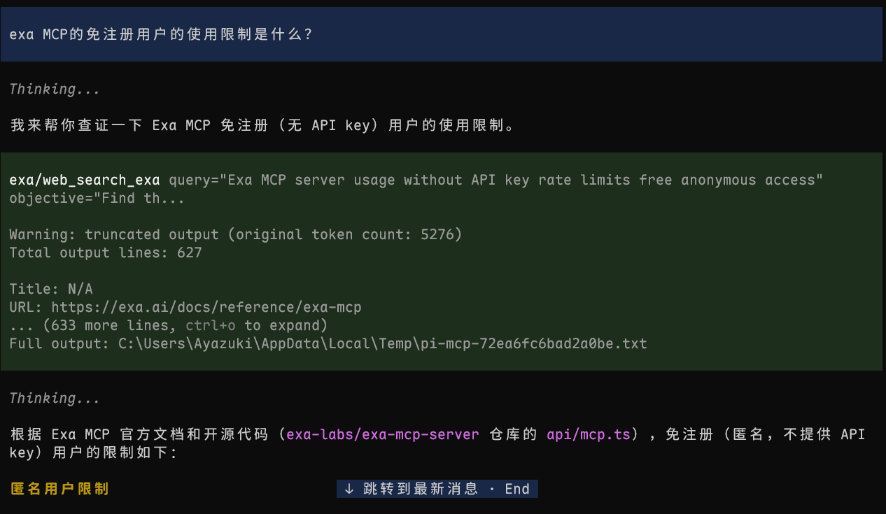

Exa MCP免注册（匿名，不提供 API key）用户的限制如下：每秒最多 2 次请求，每日工具调用配额上限为50次。触发限制时返回 **429 错误**，提示信息为`You've hit Exa's free MCP rate limit`

如果每日免费额度不够使用，可以选择在[Exa官网](https://exa.ai/)注册一个账户获取一个API Key来增加每日工具调用的免费额度。


输入自己的邮箱注册账号

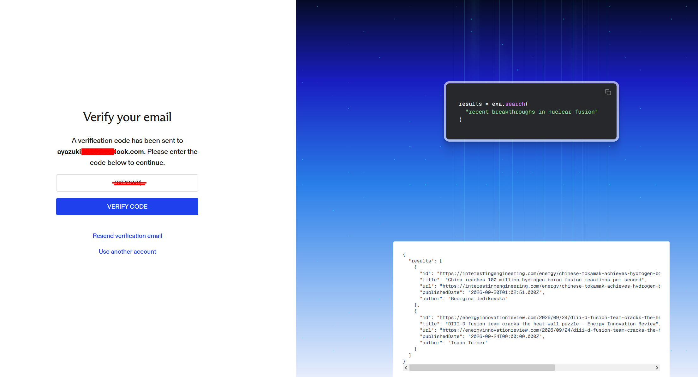

随便选两个理由，然后继续

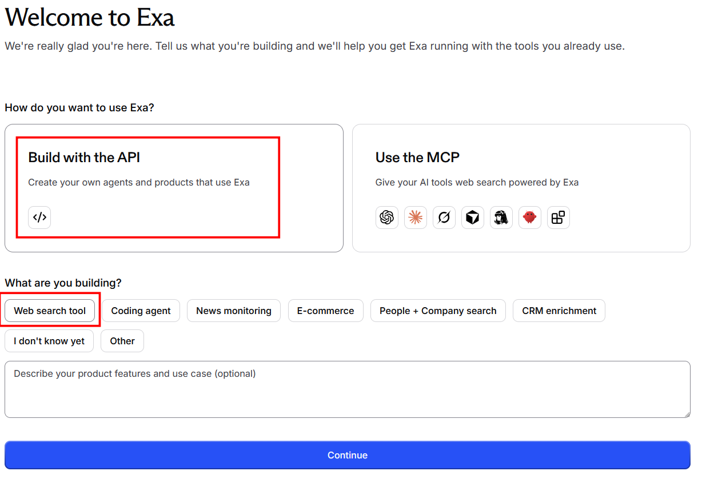

第一行的意思是复制一份提示词让Coding Agent从环境变量中读取你的API key而不是从对话中读取，点一下copy，虽然我后续不会用到这份提示词
第二行的意思是使用npx安装Exa 技能，点一下copy，虽然目前也不会用到
第三行是复制属于你的API key，点一下copy，这个是本次重点需要使用的

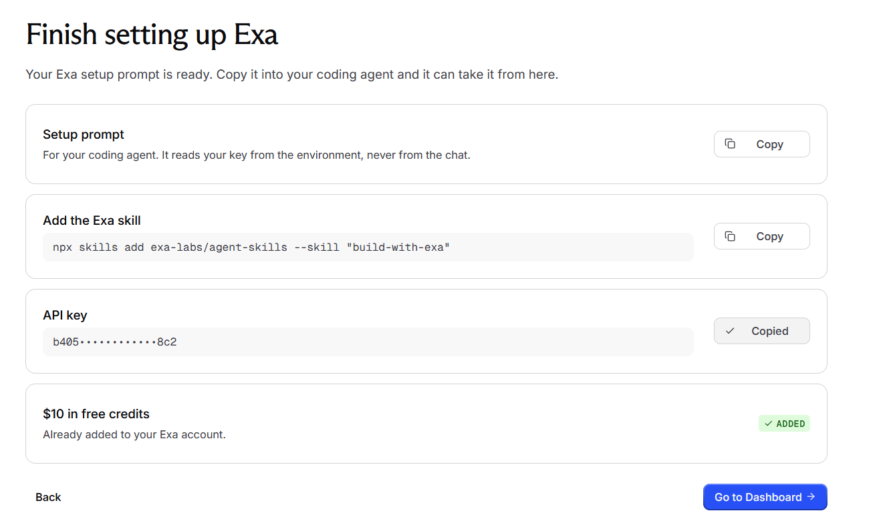

这时可以去`Dashboard（仪表盘）`看看，也可以不去，反正本次的目的已经达到了。
在`C:\Users\你的用户名\.pi\agent`打开终端启动Pi，把自己的API key喂给AI让它帮你完成相关的Exa MCP密钥配置。输入以下提示词:

`我的Exa MCP 的个人API key 是b405XXXXXXXXXXXXXXXXXXX，请帮我进行配置`

AI就会开始工作，直到配置完成，可以在`mcp.json`中看到AI修改了exa MCP的配置URL,在 URL 上追加了`?exaApiKey=你的API Key`的内容。现在`mcp.json`内容为：

```
{
   "mcpServers": {
      "academic-search": {
         "command": "python",
         "args": [
            "C:\\Users\\你的用户名\\.agents\\skills\\nature-academic-search\\mcp-server\\academic_search_server.py"
         ],
         "timeout": 120,
         "exposure": "direct",
         "description": "CrossRef/PubMed/arXiv/Scopus/ScienceDirect 多源学术检索"
      },
      //新增以下内容来添加exa MCP,粘贴后请移除此行注释不然会报错
      "exa": {
         "url": "https://mcp.exa.ai/mcp?exaApiKey=b405XXXXXXXXXXXXXX",
         "exposure": "direct"
      }
   }
}
```

配置后`/reload`，这时候Exa MCP 就应该变成了按照账户的余额来按量计费，Exa会每月赠送$10免费额度，大约可支撑 1400 次基础搜索，相关余额和用量可在[exa仪表盘](https://dashboard.exa.ai/usage)查看。

### Pi配置提示词模板

Pi缺少为当前仓库生成或更新 AGENTS.md的快捷命令，需要在`C:\Users\你的用户名\.pi\agent\`路径下新建一个 `prompts`的文件夹，pi 会把 prompts 目录下的每个 Markdown 文件按文件名注册为斜
 杠命令。这里我为Pi添加一个为当前仓库生成或更新 AGENTS.md的快捷命令`/init`。AGENTS.md是一份写给AI看的项目说明书，帮助 AI 快速上手、少踩坑。

在 prompts 目录下新建一个md文件，命名为 `init.md`，内容为：

```
---
description: 生成或更新当前仓库的 AGENTS.md
---

Create or update `AGENTS.md` for this repository.

The goal is a compact instruction file that helps future pi sessions avoid mistakes and ramp up quickly. Every line should answer: "Would an agent likely miss this without help?" If not, leave it out.

User-provided focus or constraints (honor these):

${ARGUMENTS:-无}

## How to investigate

Read the highest-value sources first:

- `README*`, root manifests, workspace config, lockfiles
- build, test, lint, formatter, typecheck, and codegen config
- CI workflows and pre-commit / task runner config
- existing instruction files (`AGENTS.md`, `AGENTS.override.md`, `CLAUDE.md`, `.cursor/rules/`, `.cursorrules`, `.github/copilot-instructions.md`, `.pi/SYSTEM.md`, `.pi/APPEND_SYSTEM.md`, `.pi/prompts/`)

If architecture is still unclear after reading config and docs, inspect a small number of representative code files to find the real entrypoints, package boundaries, and execution flow. Prefer reading the files that explain how the system is wired together over random leaf files.

Prefer executable sources of truth over prose. If docs conflict with config or scripts, trust the executable source and only keep what you can verify.

## What to extract

Look for the highest-signal facts for an agent working in this repo:

- exact developer commands, especially non-obvious ones
- how to run a single test, a single package, or a focused verification step
- required command order when it matters, such as `lint -> typecheck -> test`
- monorepo or multi-package boundaries, ownership of major directories, and the real app/library entrypoints
- framework or toolchain quirks: generated code, migrations, codegen, build artifacts, special env loading, dev servers, infra deploy flow
- repo-specific style or workflow conventions that differ from defaults
- testing quirks: fixtures, integration test prerequisites, snapshot workflows, required services, flaky or expensive suites
- important constraints from existing instruction files worth preserving

Good `AGENTS.md` content is usually hard-earned context that took reading multiple files to infer.

## Questions

Only ask the user questions if the repo cannot answer something important. Use the `ask_questions` tool for one short batch at most.

Good questions:

- undocumented team conventions
- branch / PR / release expectations
- missing setup or test prerequisites that are known but not written down

Do not ask about anything the repo already makes clear.

## Writing rules

Include only high-signal, repo-specific guidance such as:

- exact commands and shortcuts the agent would otherwise guess wrong
- architecture notes that are not obvious from filenames
- conventions that differ from language or framework defaults
- setup requirements, environment quirks, and operational gotchas
- references to existing instruction sources that matter

Exclude:

- generic software advice
- long tutorials or exhaustive file trees
- obvious language conventions
- speculative claims or anything you could not verify

Do not repeat guidance already present in the global `~/.pi/agent/AGENTS.md` or parent-directory context files — pi concatenates all of them, so duplicates waste tokens every session.

When in doubt, omit.

Prefer short sections and bullets. If the repo is simple, keep the file simple. If the repo is large, summarize the few structural facts that actually change how an agent should work.

If `AGENTS.md` already exists in the current project path, improve it in place rather than rewriting blindly. Preserve verified useful guidance, delete fluff or stale claims, and reconcile it with the current codebase.
```

这份`init.md`的内容参考借鉴了[opencode](https://opencode.ai/docs/zh-cn)内置的`/init`命令。执行时它会先阅读 README、构建与测试配置以及已有的指令文件，必要时再翻看少量代表性代码，从中提取那些不查资料就容易猜错的信息以及不同于默认习惯的项目约定。写入时只保留高信号内容，已存在的 AGENTS.md 会被就地改进而非推倒重写，也不会与全局 AGENTS.md 重复。

# 我的Pi工作流程

以复现论文实验为例：

获取到论文的源码，进入论文源码的工作路径下启动pi，在pi中首先使用`/init`初始化仓库，写一份AGENTS.md，接下来使用`brainstorming`技能描述自己的需求，发送给大模型，大模型会询问几个问题，用户确认问题的答案，大模型开始写设计方案请用户审批，用户确认设计方案无误后调用`writing-plans`技能根据这份设计方案生产一份实施计划。用户确认实施计划无误后调用`subagent-driven-development`技能进行执行，执行完毕会默认调用`requesting-code-review`评估本轮变动，请用户核实后进行修复细枝末节，最后用户的需求得以实现。
