# 安装最新的显卡驱动

首先来到[英伟达官网中国站点](https://www.nvidia.cn/software/nvidia-app/)下载`NVIDIA App`来安装最新的显卡驱动，使用`NVIDIA App`安装显卡驱动最大的优点就是省心，它会自动根据你当前的显卡型号获取适合的显卡驱动。点击官网的`立即下载`按钮下载`NVIDIA App`。

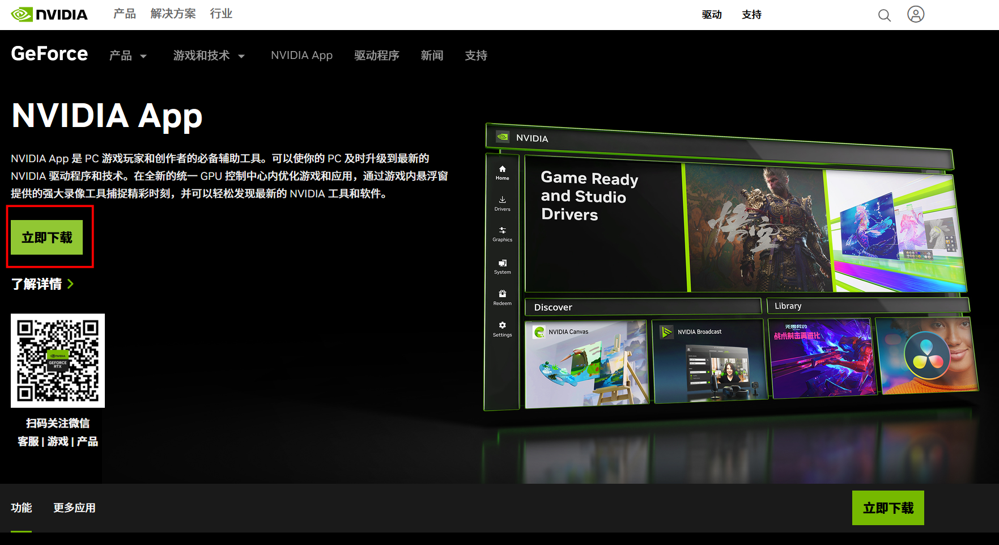

运行下载好的`NVIDIA_app_v11.0.9.251.exe`安装包安装，等候安装完成即可。

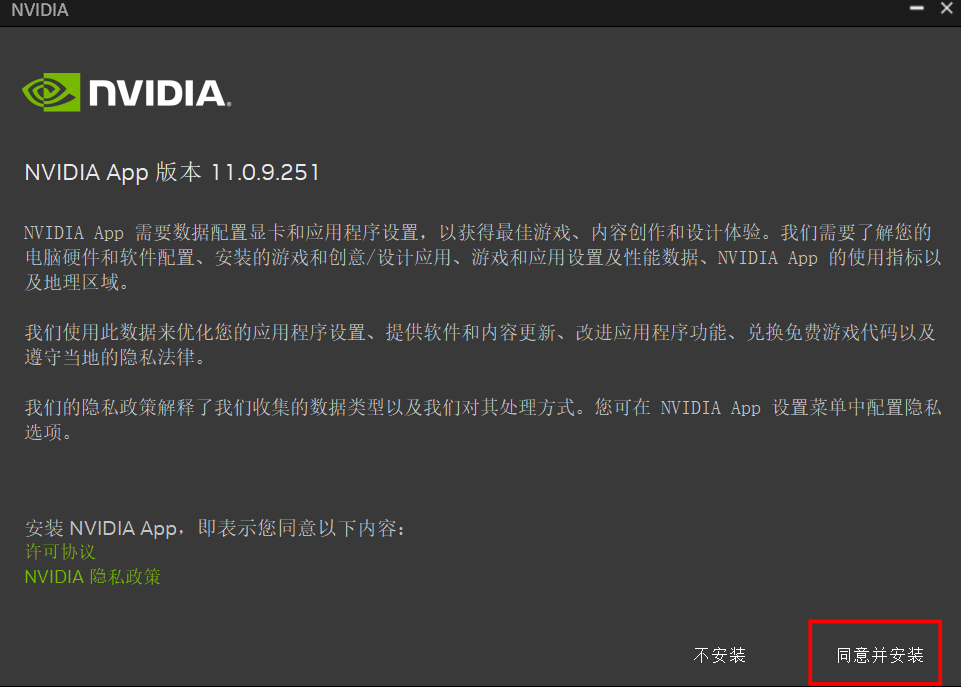

安装完成后运行该应用，可以选择不进行优化点击`下一步`即可

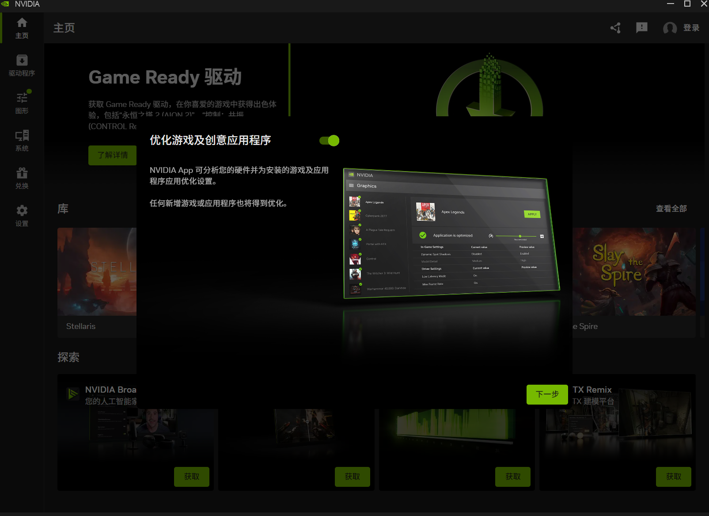

显卡驱动是不注册账号也可以下载的，这里直接点击`快进至应用程序`

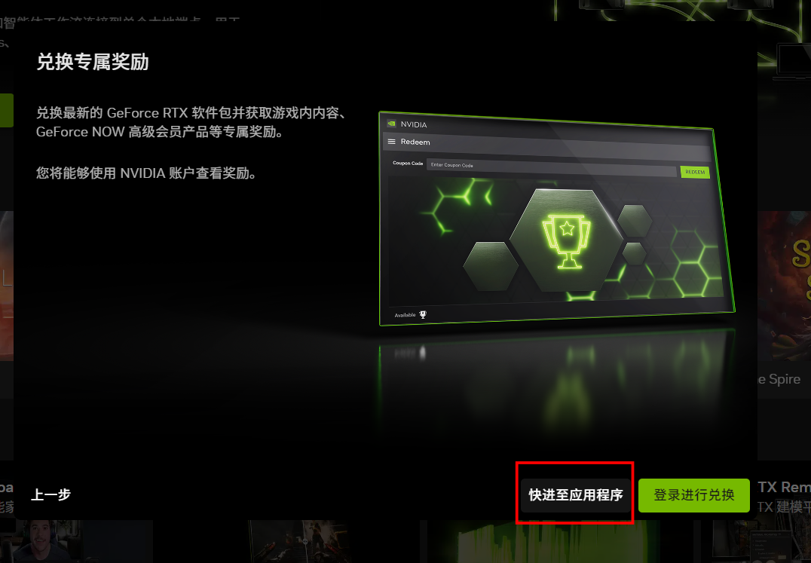

点击左边的`驱动程序` 进行 `下载`

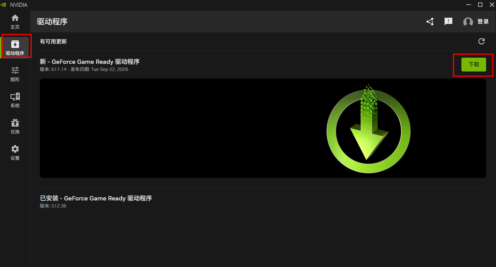

下载完成后会出现`安装`按钮，点击该按钮进行安装显卡驱动，建议在安装前关闭自己电脑的杀毒软件再进行安装，杀毒软件可能会拦截显卡驱动的正常安装。

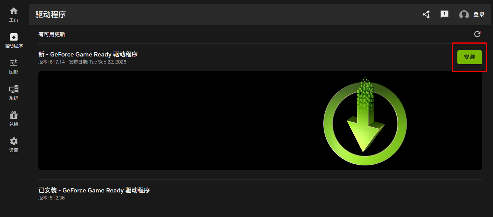

选择默认的`快速安装`即可，等待显卡驱动的安装即可

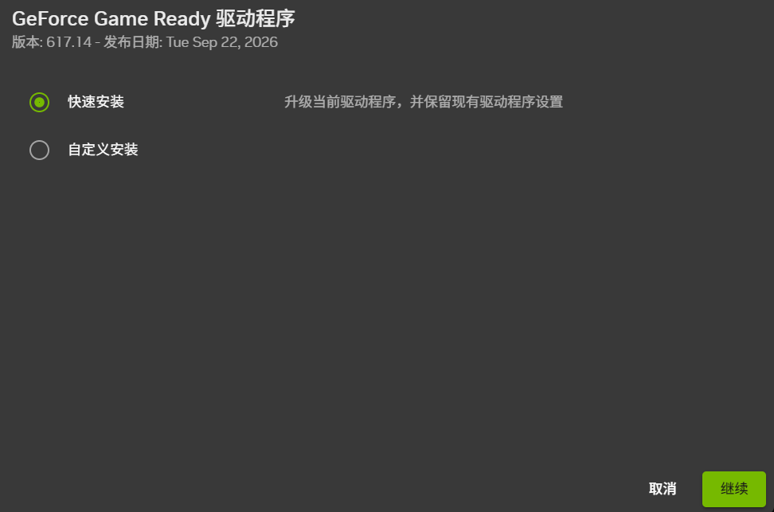

安装完成后按照要求重启电脑。

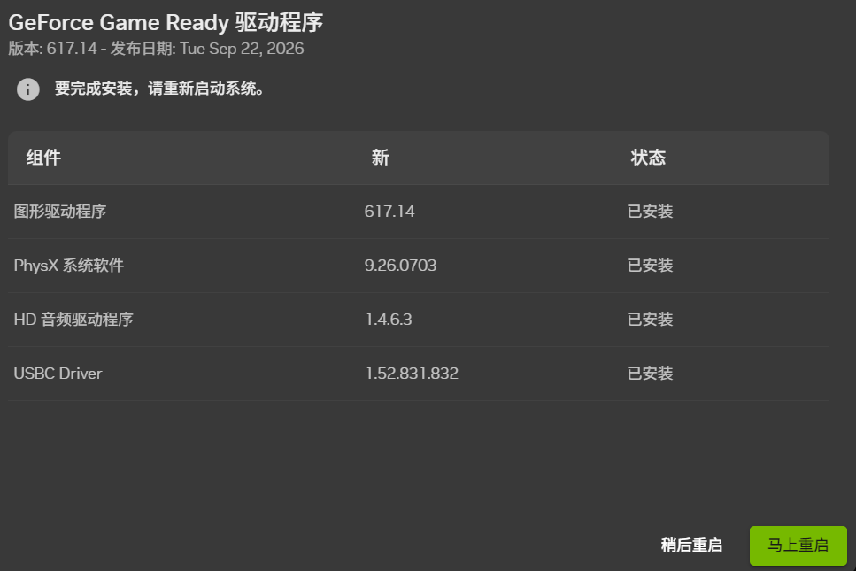

重启完成后打开Windows终端输入`nvidia-smi`查看显卡驱动信息

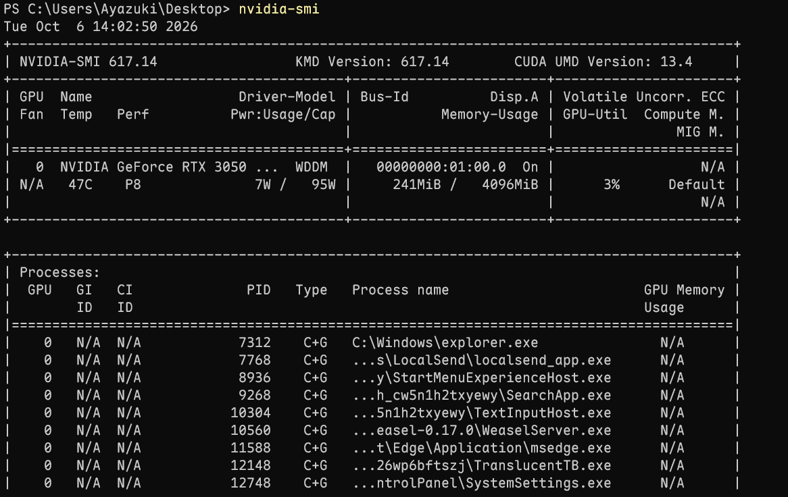

这里第一行是显卡驱动的版本号，`CUDA UMD Version：13.4`的意思是这个显卡驱动最大可支持CUDA的版本为13.4，而不是已经安装好CUDA的意思。

# 安装CUDA

接下来到[CUDA的官网](https://developer.nvidia.com/cuda/toolkit)下载CUDA

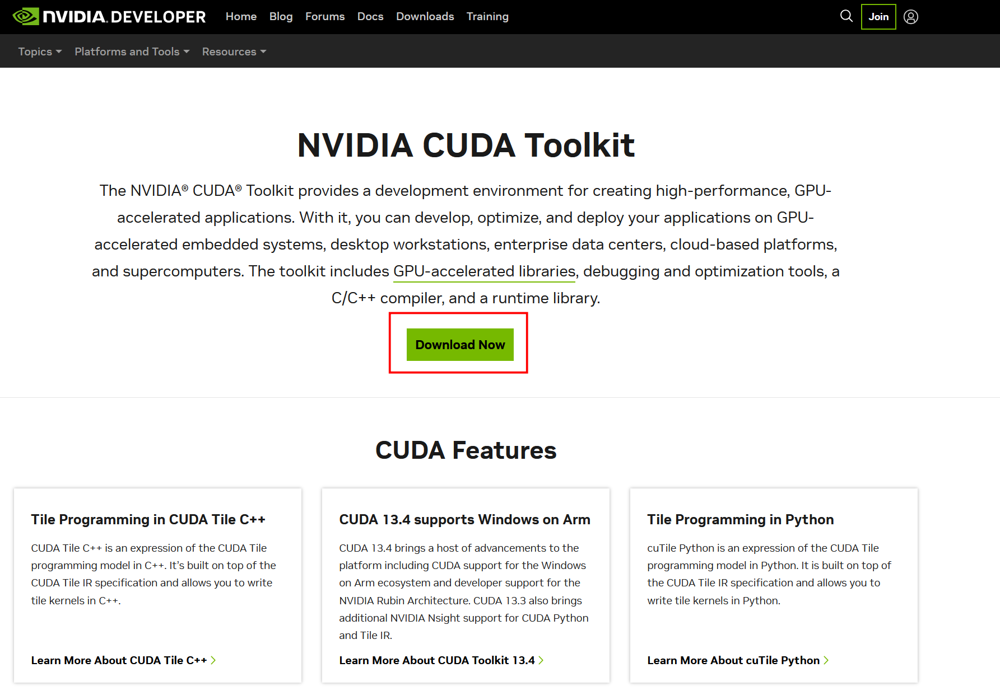

根据自己的系统配置来选择合适的安装包进行下载

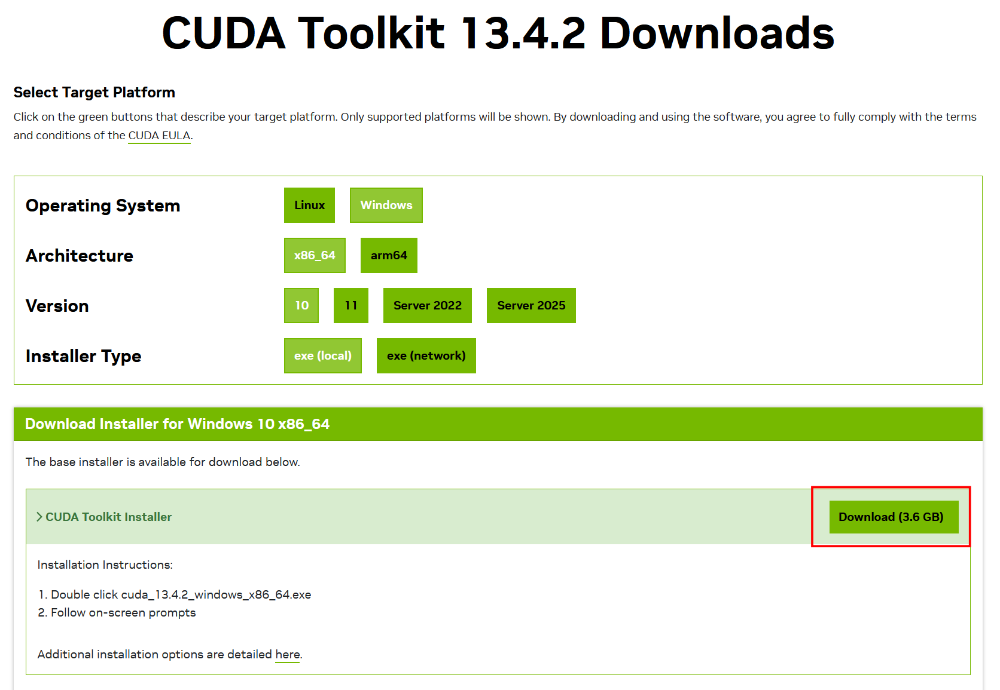

下载完成后，运行下载的CUDA安装包`cuda_13.4.2_windows_x86_64.exe`进行安装

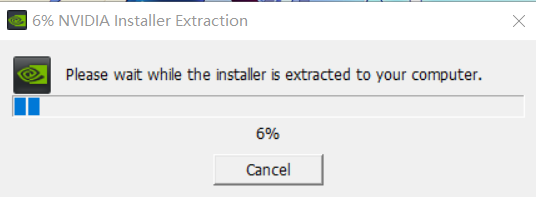

按照默认推荐的选项进行精简安装

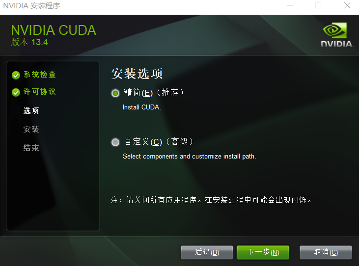

如果你没有安装过`Visual Studio`会出现以下信息：

CUDA Visual Studio 集成
未找到受支持的 Visual Studio 版本。CUDA Toolkit 的部分组件将无法正常工作。请先安装 Visual Studio，以获取完整功能。

我已知晓，并希望仍继续安装。

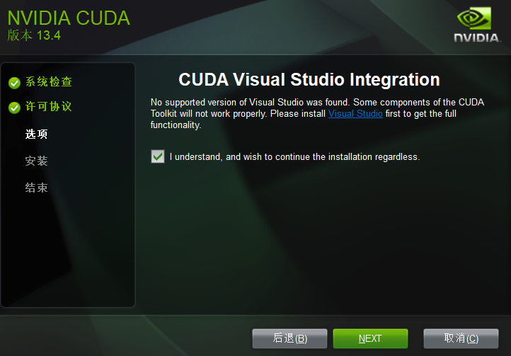

这是因为 CUDA Toolkit 中有部分组件是专门为 Visual Studio 提供的集成插件，目前我只是跑深度学习/AI 相关的东西，不涉及到开发 CUDA C++ 程序。如果后续有这方面的需求只需要安装Visual Studio 2026 后再次运行CUDA的安装程序即可补齐。

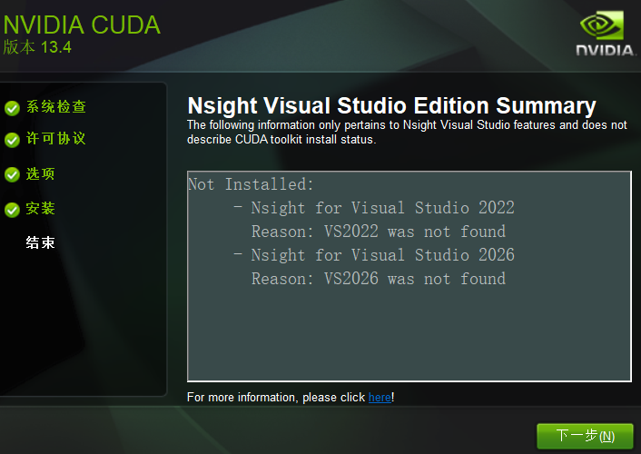

安装完成后，在Windows终端中输入`nvcc --version`，会打印出CUDA的版本号，说明CUDA已经安装完成了

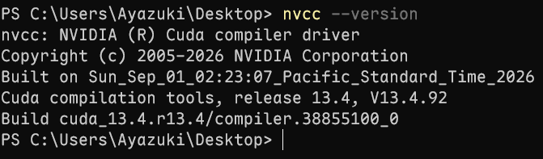
